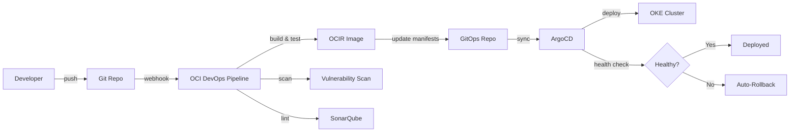

# Infraestructura OCI — Stack Tecnológico Completo

## Stack Tecnológico

### Backend
| Componente | Tecnología | Justificación |
|-----------|-----------|---------------|
| Ingesta de datos | **Go 1.22+** | Alta concurrencia (goroutines), bajo consumo de memoria, compilación estática, ideal para microservicios de alto throughput |
| Validador OCPI | **Python 3.12+** | Ecosistema rico en validación (Pydantic v2), schemas complejos, FastAPI async |

### Frontend
| Componente | Tecnología | Justificación |
|-----------|-----------|---------------|
| SPA Framework | **React 18** | Ecosistema maduro, componentes reutilizables, SSR si necesario |
| Lenguaje | **TypeScript** | Tipado estático, refactoring seguro, DX superior |
| Build tool | **Vite** | Hot reload rápido, build optimizado, ESM nativo |
| Estilos | **TailwindCSS 3** | Utility-first, consistencia, tree-shaking |
| Componentes UI | **Radix UI + shadcn/ui** | Accesibilidad (WAI-ARIA), headless, personalizable |

### Mensajería y Eventos
| Componente | Tecnología | Justificación |
|-----------|-----------|---------------|
| Event Streaming | **OCI Streaming** (Kafka API compatible) | Managed, Kafka API compatible, integración nativa OCI |
| Dead Letter Queue | **OCI Queue** | Mensajes fallidos, retry con backoff, alertas |

### Datos
| Componente | Tecnología | Justificación |
|-----------|-----------|---------------|
| BD Operacional | **OCI Autonomous Database (ATP)** | Managed, auto-scaling, auto-patching, Data Guard, Oracle 23ai |
| Time-series | **TimescaleDB** | Hypertables para telemetría cada 60s, compression, continuous aggregates |
| Data Lake | **OCI Object Storage** | Medallion architecture, lifecycle policies, WORM para auditoría |
| Caché | **Redis (OCI Cache)** | Sub-millisecond latency, TTL, pub/sub, rate limiting |

### Autenticación y Autorización
| Componente | Tecnología | Justificación |
|-----------|-----------|---------------|
| Identity Provider | **KeyCloak** | Open-source, OAuth 2.1, OIDC, SAML, LDAP federation |
| Protocolo | **OAuth 2.1** | PKCE obligatorio, DPoP, elimina flujos inseguros |
| Token format | **JWT RS256** | Firmado con RSA 2048+ en OCI Vault |
| Transporte | **mTLS** | Certificados X.509 para CPOs, CA propia UPME |
| API Keys | **Por CPO** | Identificación adicional, rate limiting |

### Infraestructura y DevOps
| Componente | Tecnología | Justificación |
|-----------|-----------|---------------|
| Kubernetes | **OKE** (Oracle Kubernetes Engine) | Managed K8s, integración nativa OCI, auto-scaling |
| IaC | **Terraform** | Multi-cloud capability, state management, módulos OCI |
| GitOps | **ArgoCD** | Declarativo, auto-sync, rollback automático |
| CI/CD | **OCI DevOps** | Integración nativa, build runners managed |
| Container Registry | **OCIR** | Vulnerability scanning, image signing |

### Seguridad
| Componente | Tecnología | Justificación |
|-----------|-----------|---------------|
| WAF | **OCI WAF** | OWASP Top 10, DDoS L7, bot detection, reglas custom |
| Secrets | **OCI Vault** | HSM FIPS 140-2 Level 3, rotación automática |
| Network | **OCI Network Firewall** | Deep Packet Inspection, IDS/IPS |
| VPN | **OCI VPN Connect** | IPSec IKEv2, site-to-site con Cárgame |
| SAST | **SonarQube** | Análisis estático de código, quality gates |
| DAST | **OWASP ZAP** | Análisis dinámico, fuzzing de APIs |

### Observabilidad
| Componente | Tecnología | Justificación |
|-----------|-----------|---------------|
| Métricas | **OCI Monitoring + Prometheus** | Métricas nativas + custom metrics |
| Logs | **OCI Logging Analytics** | Aggregación, búsqueda, retención |
| Trazas | **OCI APM** | Distributed tracing, profiling |
| Alertas | **PagerDuty** | Escalation, on-call rotation, integrations |

### DRP (Disaster Recovery Plan)
| Componente | Tecnología | Justificación |
|-----------|-----------|---------------|
| DR Strategy | **OCI Full Stack DR** | Cross-region, automated failover |
| DB Replication | **Data Guard** | Active standby, maximum availability mode |
| Object Storage | **Cross-region replication** | Data Lake replicado |
| Target | **RPO < 1h, RTO < 30min** | Requisito gubernamental |

---

## Topología de Red OCI

```
┌─────────────────────────────────────────────────────────────────────┐
│                        OCI Region: Bogotá (Primary)                 │
│                                                                     │
│  ┌─────────────────────────────────────────────────────────────┐   │
│  │                    VCN: upme-prod-vcn                        │   │
│  │                    CIDR: 10.0.0.0/16                         │   │
│  │                                                              │   │
│  │  ┌──────────────────┐  ┌──────────────────┐                 │   │
│  │  │ Public Subnet     │  │ Public Subnet     │                │   │
│  │  │ 10.0.1.0/24       │  │ 10.0.2.0/24       │                │   │
│  │  │                   │  │                   │                 │   │
│  │  │ • OCI WAF         │  │ • OCI LB          │                │   │
│  │  │ • Bastion         │  │   (TLS 1.3)       │                │   │
│  │  └──────────────────┘  └──────────────────┘                 │   │
│  │                                                              │   │
│  │  ┌──────────────────┐  ┌──────────────────┐                 │   │
│  │  │ Private Subnet    │  │ Private Subnet    │                │   │
│  │  │ 10.0.10.0/24      │  │ 10.0.11.0/24      │                │   │
│  │  │ (App Tier)        │  │ (App Tier)        │                │   │
│  │  │                   │  │                   │                 │   │
│  │  │ • OKE Workers     │  │ • OKE Workers     │                │   │
│  │  │   - Ingesta (Go)  │  │   - KeyCloak      │                │   │
│  │  │   - Validador(Py) │  │   - Portal(React) │                │   │
│  │  │   - API Gateway   │  │   - Services      │                │   │
│  │  └──────────────────┘  └──────────────────┘                 │   │
│  │                                                              │   │
│  │  ┌──────────────────┐  ┌──────────────────┐                 │   │
│  │  │ Private Subnet    │  │ Private Subnet    │                │   │
│  │  │ 10.0.20.0/24      │  │ 10.0.21.0/24      │                │   │
│  │  │ (Data Tier)       │  │ (Data Tier)       │                │   │
│  │  │                   │  │                   │                 │   │
│  │  │ • ATP (Primary)   │  │ • Redis Cluster   │                │   │
│  │  │ • TimescaleDB     │  │ • Kafka/Streaming │                │   │
│  │  └──────────────────┘  └──────────────────┘                 │   │
│  │                                                              │   │
│  └─────────────────┬────────────────────────────────────────────┘   │
│                    │                                                 │
│        ┌───────────┴──────────┐                                     │
│        │ VPN Connect (IPSec)  │                                     │
│        │ IKEv2, redundante    │                                     │
│        └───────────┬──────────┘                                     │
│                    │                                                 │
└────────────────────┼────────────────────────────────────────────────┘
                     │
                     ▼
            ┌──────────────┐
            │   Cárgame     │
            │  (External)   │
            └──────────────┘
```

---

## OKE (Oracle Kubernetes Engine)

### Configuración del Cluster

| Parámetro | Valor | Justificación |
|-----------|-------|---------------|
| Versión K8s | 1.29+ (latest stable) | Soporte OCI, features recientes |
| Node pools | 2 (app + system) | Separación de workloads |
| Worker shape | VM.Standard.E4.Flex | Costo-eficiente, flexible en CPU/RAM |
| Min nodes | 3 (HA: multi-AD) | Alta disponibilidad |
| Max nodes | 10 (HPA trigger) | Escalamiento bajo carga pico |
| Container Registry | OCIR | Scanning integrado, image signing |
| Ingress | Nginx Ingress Controller / OCI LB | Routing, TLS termination |
| Service Mesh | Istio (opcional, evaluar) | mTLS inter-service, observability |

### Namespaces

```
upme-prod/
├── upme-ingesta        # Servicio de Ingesta (Go)
├── upme-validator      # Validador OCPI (Python)
├── upme-cpo            # CPO Management Service
├── upme-query          # Query Service
├── upme-public         # Public API Service
├── upme-portal         # Portal Web (React)
├── upme-keycloak       # KeyCloak cluster
├── upme-monitoring     # Prometheus, Grafana, Jaeger
├── upme-kafka          # Kafka/Streaming consumers
└── upme-system         # ArgoCD, cert-manager, ingress
```

---

## Terraform — Estructura IaC

```
terraform/
├── environments/
│   ├── dev/
│   │   └── terraform.tfvars
│   ├── staging/
│   │   └── terraform.tfvars
│   └── prod/
│       └── terraform.tfvars
├── modules/
│   ├── networking/          # VCN, subnets, NSGs, VPN
│   ├── oke/                 # OKE cluster + node pools
│   ├── database/            # ATP + Data Guard
│   ├── streaming/           # OCI Streaming (Kafka)
│   ├── redis/               # OCI Cache (Redis)
│   ├── object-storage/      # Data Lake buckets + lifecycle
│   ├── vault/               # OCI Vault + secrets
│   ├── waf/                 # OCI WAF rules
│   ├── monitoring/          # OCI Monitoring + alarms
│   ├── dr/                  # Full Stack DR config
│   └── iam/                 # Compartments, policies, dynamic groups
├── main.tf
├── variables.tf
├── outputs.tf
└── backend.tf               # Remote state en OCI Object Storage
```

---

## ArgoCD — GitOps Pipeline



### Estrategia de Deployment

| Ambiente | Estrategia | Aprobación |
|----------|-----------|------------|
| Dev | Auto-sync (push = deploy) | Ninguna |
| Staging | Auto-sync con manual sync wave | Team Lead |
| Prod | Manual sync + canary (10%→50%→100%) | Arquitecto + DevOps Sr |

---

## DRP — Disaster Recovery Plan

### Arquitectura Cross-Region

```
Primary Region (Bogotá)           DR Region (São Paulo)
─────────────────────             ────────────────────
OKE Cluster (active)    ──DR──►  OKE Cluster (standby)
ATP Primary             ──DG──►  ATP Standby (Data Guard)
Redis Primary           ──rep──► Redis Replica
Object Storage          ──rep──► Object Storage (cross-region)
OCI Streaming           ──rep──► OCI Streaming (mirror)
VPN Connect (Cárgame)   ──DR──►  VPN Connect (backup tunnel)
```

### Objetivos

| Métrica | Target | Justificación |
|---------|--------|---------------|
| **RPO** | < 1 hora | Pérdida máxima aceptable de datos |
| **RTO** | < 30 min | Tiempo máximo para restaurar servicio |
| **DR Drill** | Trimestral | Simulacro completo de failover |

### Procedimiento de Failover

1. Detección automática (health checks + OCI monitoring)
2. Alerta P1 a equipo DevOps + Arquitecto
3. Decisión de failover (automático si > 15min down)
4. OCI Full Stack DR ejecuta switchover
5. DNS update (TTL: 60s)
6. Verificación de servicios en DR region
7. Notificación a CPOs y stakeholders
8. Post-mortem dentro de 24h
