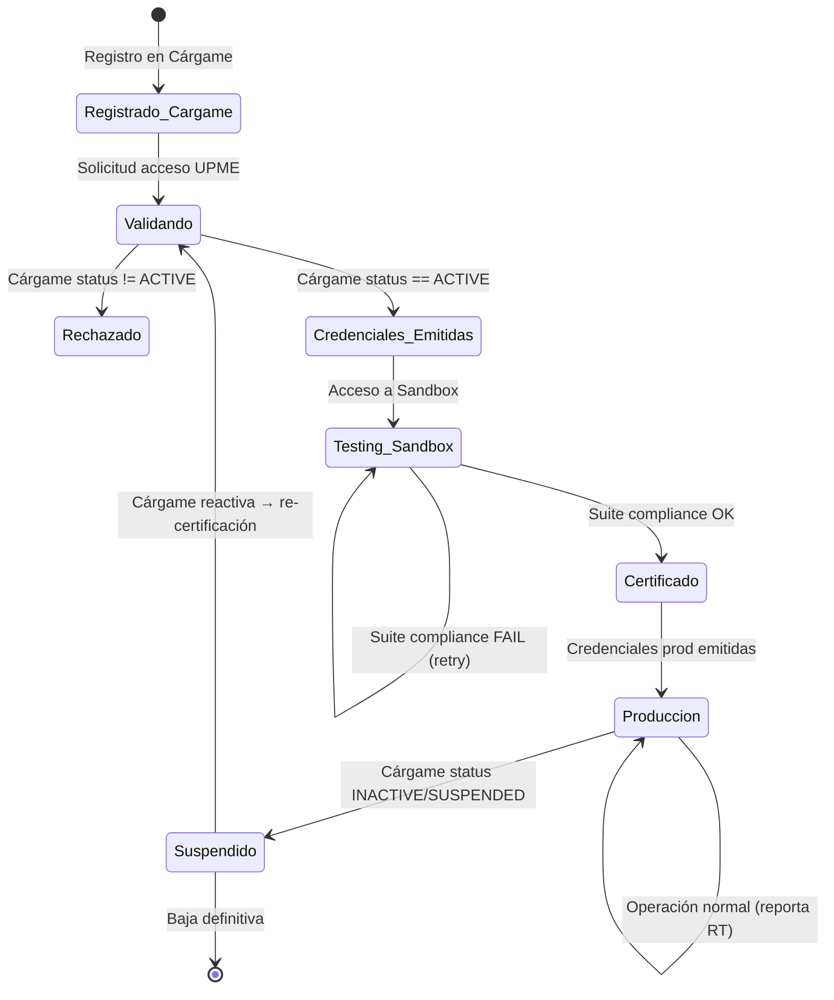
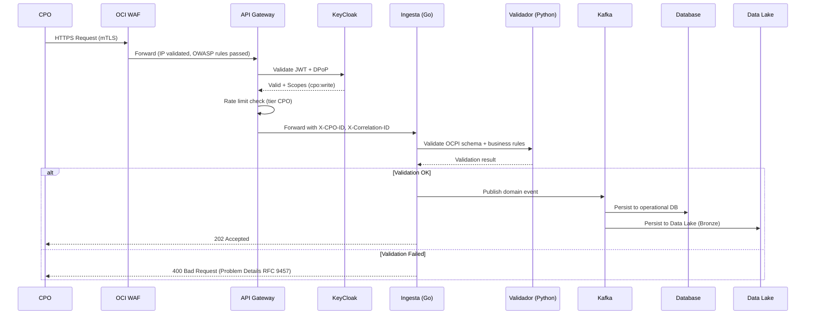

# Arquitectura del Sistema — Vista General

## Actores del Sistema

| Actor | Rol | Interacción |
|-------|-----|-------------|
| **UPME** | Administrador de la plataforma | Portal Admin, gestión de CPOs, reportes |
| **CPO** (Charge Point Operator) | Operador de puntos de carga | Reporta datos OCPI en tiempo real vía API |
| **MSP** (eMobility Service Provider) | Proveedor de servicios de movilidad | Consume datos de estaciones, tokens |
| **MinEnergía** | Regulador | Supervisa integridad de datos, recibe reportes |
| **SIC** | Superintendencia de Industria y Comercio | Protección al consumidor, audita veracidad |
| **Cárgame** | Sistema externo de registro de CPOs | Validación de habilitación vía VPN IPSec |
| **Ciudadanos** | Usuarios finales | Consulta pública de precios y disponibilidad |

---

## Bounded Contexts del Dominio UPME

```
├── CPO Management (Registro, Habilitación, Certificación)
│   └── Anti-Corruption Layer → Cárgame
│   └── Responsable: Gestión del ciclo de vida del CPO
│   └── Eventos: CPORegistered, CPOValidated, CPOCertified, CPOSuspended
│
├── OCPI Core (Locations, EVSEs, Tariffs, Sessions, CDRs, Tokens, Commands)
│   └── Ingesta (Go) + Validación (Python) + Streaming (Kafka)
│   └── Responsable: Recepción, validación y persistencia de datos OCPI
│   └── Eventos: LocationUpdated, SessionStarted, CDRCreated, TariffChanged
│
├── Identity & Access (KeyCloak, OAuth 2.1, mTLS, API Keys, DPoP)
│   └── Responsable: Autenticación, autorización, gestión de identidades
│   └── Eventos: TokenIssued, TokenRevoked, CertificateExpiring
│
├── Public Data (Consulta pública: precios, disponibilidad, ubicación RT)
│   └── Responsable: API Open Data para ciudadanos
│   └── Eventos: PublicDataRefreshed, PriceChanged
│
├── Data Governance (Data Lake, ETL, Catálogo, Calidad)
│   └── Responsable: Dato como activo de gobierno
│   └── Eventos: DataQualityAlert, AnomalyDetected, LineageUpdated
│
├── Observability & Audit (Monitoring, Logging, Alertas, Audit Trail SIC)
│   └── Responsable: Visibilidad total, cumplimiento SIC
│   └── Eventos: AlertFired, SLOBreach, AuditRecordCreated
│
└── Integration (Cárgame VPN, Webhooks CPO, Notificaciones RT)
    └── Responsable: Comunicación con sistemas externos
    └── Eventos: CargameValidationCompleted, WebhookDelivered
```

### Context Map — Relaciones entre Bounded Contexts

```
┌─────────────────┐     Conformist      ┌──────────────────┐
│  CPO Management │◄────────────────────►│    Cárgame        │
│                 │  (ACL: Anti-         │  (External)       │
└────────┬────────┘   Corruption Layer)  └──────────────────┘
         │
         │ Published Language (OCPI 2.2.1)
         ▼
┌─────────────────┐    Shared Kernel     ┌──────────────────┐
│   OCPI Core     │◄───────────────────►│ Identity & Access │
│                 │   (JWT, CPO ID)      │   (KeyCloak)      │
└────────┬────────┘                      └──────────────────┘
         │
         │ Domain Events (Kafka)
         ▼
┌─────────────────┐                      ┌──────────────────┐
│  Public Data    │◄─ Customer/Supplier ─│ Data Governance   │
│  (Open Data)    │                      │ (Data Lake)       │
└─────────────────┘                      └──────────────────┘
         │                                        │
         └────────────► Observability & Audit ◄───┘
```

---

## Diagrama C4 — Structurizr DSL

### System Context + Container (Nivel 1 y 2)

```structurizr
workspace "UPME Plataforma Interoperabilidad" {
    !identifiers hierarchical

    model {
        cpo = person "CPO" "Operador de Puntos de Carga — Reporta datos OCPI en tiempo real"
        msp = person "MSP" "Proveedor de servicios de movilidad eléctrica"
        consumer = person "Ciudadano" "Usuario final que carga su vehículo eléctrico"
        upmeAdmin = person "Admin UPME" "Administrador de la plataforma"
        minEnergia = person "MinEnergía" "Regulador — supervisa integridad de datos"
        sic = person "SIC" "Superintendencia — protección al consumidor"

        upme = softwareSystem "Plataforma UPME" "Sistema de interoperabilidad de carga eléctrica" {
            apiGateway = container "API Gateway" "OCI API Gateway / Kong" "Rate limiting, JWT, routing"
            ingestService = container "Servicio de Ingesta" "Go 1.22+" "Alta concurrencia, validación inicial"
            ocpiValidator = container "Validador OCPI" "Python 3.12+" "Schema + business rules validation"
            keycloak = container "KeyCloak" "Identity Provider" "OAuth2, mTLS, JWT, RBAC"
            streaming = container "Event Streaming" "OCI Streaming (Kafka)" "Async processing"
            dataLake = container "Data Lake" "OCI Object Storage" "Bronze → Silver → Gold"
            database = container "Base de Datos" "OCI Autonomous DB" "Datos operacionales"
            redis = container "Redis Cache" "OCI Cache" "Validaciones Cárgame, rate limiting"
            portal = container "Portal Web" "React 18 + TypeScript" "Dashboard, consulta pública"
            sandbox = container "Sandbox" "OKE" "Ambiente de pruebas para CPOs"
        }

        cargame = softwareSystem "Cárgame" "Sistema externo de registro de CPOs" "External"

        cpo -> upme.apiGateway "Reporta datos OCPI" "HTTPS + mTLS"
        upme.apiGateway -> upme.keycloak "Valida JWT"
        upme.apiGateway -> upme.ingestService "Forward request"
        upme.ingestService -> upme.ocpiValidator "Valida schema"
        upme.ingestService -> upme.streaming "Publica evento"
        upme.ingestService -> upme.redis "Cache lookup"
        upme.redis -> cargame "Valida CPO (cache miss)" "VPN IPSec"
        upme.streaming -> upme.dataLake "Persiste evento"
        upme.streaming -> upme.database "Actualiza estado"
        consumer -> upme.portal "Consulta precios, disponibilidad"
        upmeAdmin -> upme.portal "Administra plataforma"
        sic -> upme.portal "Audita datos"
    }

    views {
        systemContext upme "SystemContext" {
            include *
            autoLayout
        }
        container upme "Containers" {
            include *
            autoLayout
        }
        theme default
    }
}
```

---

## Ciclo de Vida del CPO



### Estados del CPO — Detalle

| Estado | Descripción | Transiciones posibles | Responsable |
|--------|------------|----------------------|-------------|
| `Registrado_Cargame` | CPO registrado en el sistema Cárgame | → Validando | Cárgame |
| `Validando` | UPME verifica estado en Cárgame | → Credenciales_Emitidas, → Rechazado | UPME + Cárgame |
| `Rechazado` | CPO no activo en Cárgame | (terminal) | UPME |
| `Credenciales_Emitidas` | Credenciales de sandbox emitidas | → Testing_Sandbox | UPME |
| `Testing_Sandbox` | CPO ejecutando suite de compliance | → Certificado, → Testing_Sandbox (retry) | CPO + UPME |
| `Certificado` | CPO aprobó compliance | → Produccion | UPME |
| `Produccion` | CPO operando en producción | → Suspendido | CPO + UPME |
| `Suspendido` | CPO suspendido por cambio en Cárgame | → Validando, → Baja definitiva | UPME + Cárgame |

---

## Flujo Principal — Ingesta OCPI


