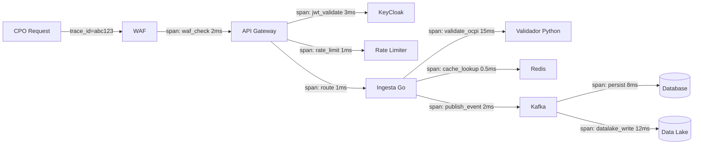

# Observabilidad y Monitoreo — Estrategia Integral

_"Si no lo puedes medir, no lo puedes operar. Si no lo puedes correlacionar, no lo puedes diagnosticar. Si no puedes anticiparlo, llegas tarde."_

## Los 4 Pilares de Observabilidad

| Pilar | Descripción | Herramienta Cloud (OCI) | On-Premise |
|-------|------------|------------------------|------------|
| **Métricas** | Valores numéricos agregados (latencia, throughput, error rate) | OCI Monitoring + Prometheus | Prometheus + Thanos |
| **Logs** | Registros inmutables de eventos (JSON, correlation ID) | OCI Logging Analytics | ELK Stack |
| **Trazas** | Propagación end-to-end de requests (distributed tracing) | OCI APM | Jaeger / Tempo |
| **Auditoría regulatoria** | Logs inmutables WORM para SIC | Object Storage WORM | SIEM + WORM storage |

---

## Capa 1: Observabilidad de Tráfico (Network & Edge)

### Componentes Monitoreados

| Componente | Métricas Clave | Cloud (OCI) | On-Premise |
|-----------|---------------|-------------|------------|
| **WAF** | Requests blocked, top attack vectors, bot score | OCI WAF Metrics | ModSecurity + ELK |
| **Load Balancer** | Connections/s, bandwidth, health check status | OCI LB Metrics | HAProxy + Prometheus |
| **VPN (Cárgame)** | Tunnel status, latency, packet loss | OCI VPN Monitoring | IPSec + Nagios/Zabbix |
| **DNS** | Resolution time, query volume, NXDOMAIN rate | OCI DNS Metrics | CoreDNS + Prometheus |
| **mTLS** | Handshake failures, cert expiry countdown | OCI Certificates | PKI + cert-manager |
| **IP Filtering** | Blocked IPs, unknown IP attempts | NSG Flow Logs | Firewall logs + SIEM |

### Dashboard de Tráfico

```
┌─────────────────┬──────────────────┬────────────────────────────────┐
│ Requests/s      │ Bandwidth In/Out │ Active Connections             │
│ (por CPO, ruta) │ (por túnel VPN)  │ (por origen: CPO/Portal/Pub)   │
├─────────────────┼──────────────────┼────────────────────────────────┤
│ WAF Blocks/min  │ mTLS Failures    │ Top 10 IPs by Volume           │
│ (por regla)     │ (cert exp/revoke)│ (con flag si IP desconocida)   │
├─────────────────┼──────────────────┼────────────────────────────────┤
│ GeoIP Map       │ TLS Handshake    │ VPN Tunnel Status              │
│ (origen tráfico)│ Latency P95      │ (Cárgame: UP/DOWN + latency)   │
└─────────────────┴──────────────────┴────────────────────────────────┘
```

### Alertas de Tráfico

| Alerta | Condición | Severidad | Acción |
|--------|-----------|-----------|--------|
| WAF attack spike | > 100 blocks/min sustained 5min | Alta | Notificar Seguridad IT |
| VPN Cárgame down | Tunnel down > 2 min | Critica | PagerDuty + circuit breaker |
| mTLS cert near expiry | < 15 días | Media | Notificar CPO + DevOps |
| Unknown IP traffic | IP no registrada > 10/min | Alta | Block automático + investigar |
| Bandwidth anomaly | > 3sigma del baseline | Media | Investigar exfiltration |

---

## Capa 2: Observabilidad de Servicios (Application & Runtime)

### Métricas RED por Servicio

| Servicio | Rate (req/s) | Error Rate (%) | Duration P50/P95/P99 |
|----------|-------------|----------------|---------------------|
| API Gateway | Global + por ruta + por CPO | 4xx, 5xx separados | < 10ms added P99 |
| Ingesta (Go) | Por CPO + por módulo OCPI | Validation errors, timeouts | < 100ms P99 |
| Validador OCPI (Python) | Por schema validado | Schema failures, rule violations | < 200ms P99 |
| KeyCloak | Auth requests/s, token issues/s | Auth failures, revocations | < 50ms P99 |
| Kafka/Streaming | Messages/s in/out, lag por consumer | DLQ entries, deser errors | Lag < 1000 msgs |
| Redis | Commands/s, hit ratio | Evictions, connection errors | < 1ms P99 |
| Portal (React) | Page views, API calls | JS errors, failed fetches | LCP < 2.5s |

### Métricas USE por Recurso

| Recurso | Utilization | Saturation | Errors |
|---------|-------------|------------|--------|
| CPU (pods) | % uso por pod/nodo | Throttling events | OOMKill count |
| Memory | % uso, RSS, heap | GC pressure | OOMKill, swap |
| Disk I/O | IOPS, throughput | Queue depth | I/O errors |
| Network | Bandwidth per pod | Connection queue overflow | TCP retransmits |
| DB Connections | Active / pool size | Wait queue length | Timeouts |

### Distributed Tracing



### Instrumentación Obligatoria

| Componente | SDK | Exporter |
|-----------|-----|---------|
| Go (Ingesta) | OpenTelemetry SDK | OTLP → OCI APM / Jaeger |
| Python (Validador) | OpenTelemetry SDK | OTLP → OCI APM / Jaeger |
| React (Portal) | OpenTelemetry Browser SDK | Core Web Vitals + API tracing |
| KeyCloak | Micrometer metrics | Event listeners para auth audit |
| Kafka | Consumer lag monitoring | Burrow / custom |

---

## Capa 3: Observabilidad de Datos (Data Layer)

| Componente | Métricas Clave | Umbral Alerta |
|-----------|---------------|--------------|
| **ATP** | Query latency P95, active sessions, IOPS, Data Guard lag | Lag > 30s = Alta; Storage > 80% = Media |
| **TimescaleDB** | Chunk compression, retention execution, insert rate | Insert backlog > 5min = Alta |
| **Redis** | Hit rate, memory, eviction rate, clients | Hit rate < 90% = Investigar; Memory > 80% = Media |
| **Kafka** | Consumer lag, messages/s, DLQ size | Lag > 5000 = Alta; DLQ > 0 = Media |
| **Object Storage** | Write throughput, object count by tier | Bronze retention breach = Alta |
| **GoldenGate** | Replication lag, extract/replicat status | Lag > 60s = Alta; Status != RUNNING = Critica |

### Data Quality Monitoring

```
□ Freshness: ¿Los datos del CPO llegaron en los últimos 5 minutos?
□ Volume: ¿El volumen está dentro de ±2sigma del baseline?
□ Schema: ¿Cumplen con el schema OCPI 2.2.1?
□ Completeness: ¿Todos los campos obligatorios presentes?
□ Uniqueness: ¿No hay duplicados (idempotencia verificada)?
□ Consistency: ¿Precios/disponibilidad coherentes con histórico?
□ Timeliness: ¿Timestamp < 5 minutos de antigüedad?
```

---

## Capa 4: Observabilidad de Negocio (Business & Anomaly Detection)

### KPIs en Tiempo Real

| KPI | Descripción | Alerta si... |
|-----|------------|-------------|
| Estaciones reportando | % activas con reporte en última hora | < 90% del total |
| Tiempo medio de reporte | Latencia evento→recepción UPME | > 5 minutos |
| Consistencia de precios | Variación kWh vs histórico | Cambio > 50% en < 1h |
| Disponibilidad vs real | "Available" sin sesiones en 24h | > 20% estaciones fantasma |
| Sesiones/hora | Volumen por región y CPO | Caída > 30% vs misma hora semana anterior |
| CPOs activos | Enviando datos en último ciclo (1h) | < 95% de CPOs certificados |
| Tasa errores OCPI | % reportes rechazados | > 5% para un CPO |
| Anomalía CDRs | Valores atípicos (energía, duración, costo) | Z-score > 3 |
| Freshness consulta pública | Antigüedad dato en API Open Data | > 10 min de retraso |
| Cumplimiento SLA por CPO | % uptime reporte vs SLA contractual | < 99.9% mensual |

### Dashboard Centro de Control

```
┌───────────────────┬──────────────────────┬──────────────────────────────────┐
│ CPOs Activos      │ Estaciones Online    │ Sesiones de Carga Activas        │
│ 47/50 (94%)       │ 589/612 (96%)        │ 1,247 en tiempo real             │
├───────────────────┼──────────────────────┼──────────────────────────────────┤
│ Reportes/min      │ Error Rate OCPI      │ Latencia Ingesta P95             │
│ 3,142             │ 1.2%                 │ 87ms                             │
├───────────────────┼──────────────────────┼──────────────────────────────────┤
│ Anomalías (24h)   │ SLA Compliance       │ Data Freshness (Public API)      │
│ 3 bajo investig.  │ 99.94% global        │ 28s (target: < 60s)              │
├───────────────────┴──────────────────────┴──────────────────────────────────┤
│ [Mapa] Estaciones por estado: Online / Degraded / Offline / Unknown        │
│ [Heatmap] Sesiones de carga por región y hora                              │
│ [Timeline] Eventos significativos últimas 24h                              │
└─────────────────────────────────────────────────────────────────────────────┘
```

### Anomaly Detection

| Tipo | Regla | Acción |
|------|-------|--------|
| PRECIO | Cambio > 50%, negativo, = 0 prolongado | Alert + notificar CPO + log SIC |
| DISPONIBILIDAD | "Available" sin sesiones > 24h | Alert + investigar |
| VOLUMEN | CPO reporta 0 datos > 1h, spike > 5x baseline | Alert + circuit breaker check |
| TEMPORAL | Timestamps futuros o > 5min antigüedad | Rechazar + alert |
| GEOGRAFICO | Ubicación cambió > 1km | Alert + verificar |
| ENERGIA | kWh > capacidad física del conector | Rechazar + alert |

---

## Alerting — Escalation Matrix

| Severidad | Tiempo respuesta | Notificación | Ejemplo |
|-----------|-----------------|--------------|---------|
| **P1 Critica** | < 15 min | PagerDuty + SMS + Slack #incidents | Plataforma caída, VPN down, data corruption |
| **P2 Alta** | < 1 hora | PagerDuty + Slack #alerts | CPO principal sin reportar > 1h, error rate > 10% |
| **P3 Media** | < 4 horas | Slack #monitoring + email | Anomalía precios, cert expiry < 15d |
| **P4 Baja** | < 24 horas | Slack #monitoring | Performance degradation < 20% |
| **P5 Info** | Siguiente business day | Dashboard only | Trends, capacity planning |

---

## SLOs (Service Level Objectives)

| Servicio | SLO | Error Budget (30d) | Indicador |
|----------|-----|-------------------|-----------|
| API Ingesta | 99.9% disponibilidad | 43.2 min downtime | Success rate (2xx + 4xx válidos) |
| API Consulta Pública | 99.9% disponibilidad | 43.2 min downtime | Success rate |
| Latencia Ingesta | P99 < 500ms | < 0.1% requests > 500ms | Histogram percentile |
| Latencia Consulta Pública | P95 < 150ms | < 5% requests > 150ms | Histogram percentile |
| Data Freshness (Public) | < 60s de retraso | < 5% periodos > 60s | Max(now - last_update) |
| Kafka Consumer Lag | < 1000 mensajes | < 5% periodos > 1000 | Max consumer lag |
| KeyCloak Auth | 99.99% disponibilidad | 4.3 min downtime | Auth success rate |
| VPN Cárgame | 99.9% tunnel uptime | 43.2 min downtime | Tunnel health probe |

---

## Checklist de Observabilidad

Aplicar a **CADA** microservicio, feature y release:

```
□ Métricas RED implementadas (Rate, Errors, Duration) con labels por CPO
□ Métricas USE implementadas (Utilization, Saturation, Errors)
□ Logging estructurado (JSON) con: timestamp, level, service, correlation_id, cpo_id, message
□ NO hay PII en logs (emails, nombres, tokens enmascarados)
□ Distributed tracing habilitado (OpenTelemetry, trace_id en headers)
□ Dashboard de servicio creado/actualizado en Grafana con RED + USE
□ Alertas configuradas con umbrales basados en baseline (no hardcodeados)
□ Runbook documentado para cada alerta P1/P2
□ Health check endpoint (/health, /ready) implementado y registrado en LB
□ SLO definido y monitoreado (error budget visible en dashboard)
□ Anomaly detection rules actualizadas si genera datos de negocio
□ Audit trail habilitado si maneja datos auditables por SIC
□ Synthetic monitoring configurado (probe externo cada 60s para endpoints críticos)
□ Capacity planning: forecast de crecimiento visible
□ Chaos testing ejecutado: ¿se recupera y las alertas funcionan?
```

> **Plantilla de runbook:** [`../templates/runbook.md`](../templates/runbook.md)
