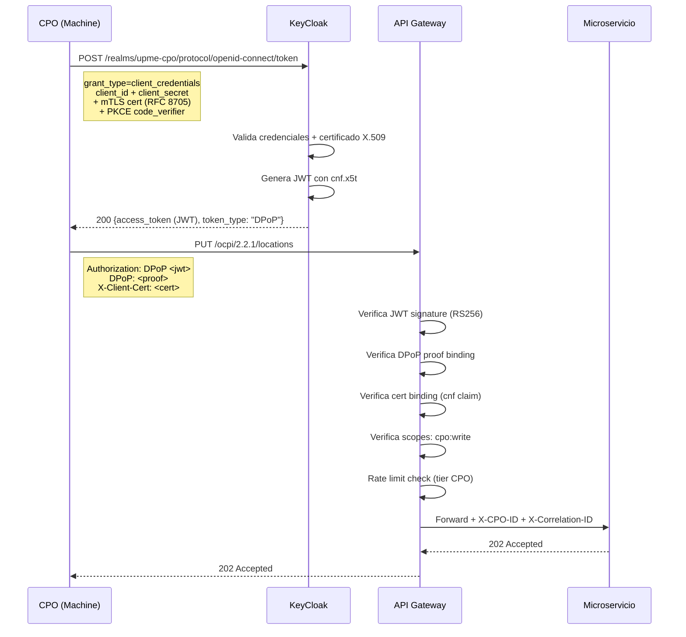
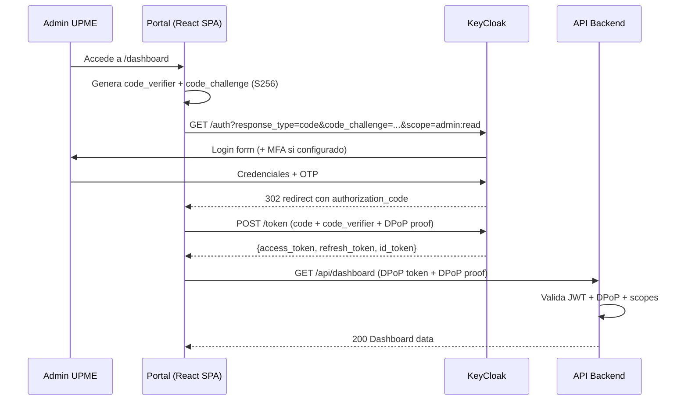

# Autenticación OAuth 2.1 con KeyCloak

## ¿Por qué OAuth 2.1 y no OAuth 2.0?

OAuth 2.1 (RFC en progreso, basado en OAuth 2.0 Security Best Current Practice - RFC 9700) consolida mejores prácticas obligatorias:

| Mejora | Detalle |
|--------|---------|
| **PKCE obligatorio** | Para TODOS los flujos (no solo públicos) — elimina interceptación de authorization code |
| **Elimina Implicit Grant** | Vulnerabilidades de token en URL fragment |
| **Elimina ROPC** | Resource Owner Password Credentials — flujo inseguro deprecado |
| **Exact string matching** | redirect URIs sin wildcards |
| **Refresh tokens** | Sender-constrained o de uso único |
| **DPoP recomendado** | Demonstrating Proof-of-Possession para tokens de alta criticidad |

---

## Configuración KeyCloak

### Realms

| Realm | Usuarios | Propósito |
|-------|---------|-----------|
| `upme-internal` | Usuarios internos UPME | LDAP/AD federation, MFA obligatorio |
| `upme-cpo` | CPOs y MSPs | Registro externo, client credentials, mTLS |
| `upme-public` | Portal público | Anonymous + registro opcional |

### Clients por Tipo de Consumidor

| Client | Grant Type | Seguridad | Scope |
|--------|-----------|-----------|-------|
| **CPO Machine-to-Machine** | `client_credentials` | + PKCE + mTLS (Certificate-Bound - RFC 8705) | `cpo:write`, `cpo:read` |
| **Portal Admin SPA** | `authorization_code` | + PKCE + DPoP + refresh token rotation | `admin:full`, `admin:read` |
| **Portal Público** | `authorization_code` | + PKCE (scopes limitados) | `public:read` |
| **Service-to-Service** | `client_credentials` | + audience restriction | Interno |

### Token Policies

| Parámetro | CPO M2M | Portal Admin | Portal Público |
|-----------|---------|-------------|----------------|
| Access Token TTL | 5 min | 15 min | 30 min |
| Refresh Token TTL | N/A (re-auth) | 8h | 4h |
| Refresh Rotation | N/A | Activada + reuse detection | Activada |
| Token Format | JWT RS256 | JWT RS256 | JWT RS256 |
| Signing Key | RSA 2048+ en OCI Vault | RSA 2048+ en OCI Vault | RSA 2048+ en OCI Vault |
| Key Rotation | Anual | Anual | Anual |

### Roles y Permisos (RBAC)

| Rol | Descripción | Asignado a |
|-----|------------|------------|
| `cpo:write` | Reportar datos OCPI (Locations, Sessions, CDRs) | CPOs certificados |
| `cpo:read` | Consultar datos propios | CPOs |
| `admin:full` | Administración completa de la plataforma | Admin UPME |
| `admin:read` | Dashboards y reportes | Equipo UPME |
| `public:read` | Consulta pública (precios, disponibilidad) | Ciudadanos |
| `sic:audit` | Acceso de auditoría SIC (read-only, todos los CPOs) | SIC |
| `cargame:validate` | Validación de CPOs contra Cárgame | Sistema (interno) |

### Federación e Integración

| Tipo | Detalle |
|------|---------|
| **LDAP/AD** | User Federation para usuarios internos UPME |
| **SAML 2.0/OIDC** | CPOs corporativos con IdP propio |
| **Custom SPI** | Validación automática contra Cárgame en registro |

### Alta Disponibilidad

| Componente | Configuración |
|-----------|---------------|
| Cluster | Mínimo 2 réplicas en OKE, HPA configurado |
| Base de datos | PostgreSQL dedicada con Data Guard |
| Sesiones | Infinispan distributed cache |
| Health checks | Readiness + liveness probes |

---

## Flujos de Autenticación

### Flujo 1: Client Credentials + mTLS (CPO → Plataforma)



### Flujo 2: Authorization Code + PKCE + DPoP (Portal Admin)



---

## Vulnerabilidades y Mitigaciones

| Ataque | Mitigación | Verificación (PenTest) |
|--------|------------|----------------------|
| Token theft/replay | DPoP + Certificate-Bound tokens | Replay token desde otra máquina |
| Authorization code interception | PKCE S256 obligatorio | Interceptar code sin verifier |
| JWT algorithm confusion (alg:none) | Validar alg=RS256 explícitamente en GW | Enviar JWT con alg:none |
| Refresh token theft | Rotation + reuse detection → revoca familia completa | Usar refresh token dos veces |
| Client impersonation | mTLS + client_secret + PKCE | Usar credenciales sin cert |
| Scope escalation | Validar scopes en API Gateway Y en microservicio | Modificar scopes en JWT |
| Open redirect | Exact match redirect_uri (no wildcards) | Redirect a dominio externo |

---

## Checklist de Autenticación

Aplicar a **TODA** propuesta que involucre auth:

```
□ OAuth 2.1 compliance verificado (no Implicit, no ROPC, PKCE obligatorio)
□ Tokens son sender-constrained (DPoP o Certificate-Bound)
□ Access Token TTL mínimo viable (5-30 min según caso)
□ Refresh Token con rotación y reuse detection activada
□ JWT firmado con RS256 (clave RSA en OCI Vault, rotación anual)
□ Claims mínimos en JWT (sub, iss, aud, exp, iat, scope, cnf)
□ Audience restriction configurada (aud = API específica)
□ mTLS certificado X.509 verificado para CPOs (CA propia UPME)
□ Revocación de tokens funcional (endpoint /revoke + propagación < 30s)
□ CORS restrictivo en KeyCloak (solo origins conocidos)
□ Brute force protection activada en KeyCloak (lockout tras 5 intentos)
□ Session idle timeout configurado (15 min admin, 30 min público)
□ Logout completo implementado (front-channel + back-channel + token revocation)
□ Logs de autenticación inmutables para auditoría SIC
□ PoC validado con CPO piloto antes de producción
```
