# Arquitectura C4 + DDD — Plataforma de Interoperabilidad UPME

> **Autor:** Agente Arquitecto de Software Senior (ROL 1)  
> **Fecha:** Febrero 2026 | **Versión:** 1.0 | **Estado:** Propuesto  
> **Regulación:** Resolución 40559/2025 — MinEnergía | **Estándar:** OCPI 2.2.1

---

## Tabla de Contenido

1. [DDD Context Map](#1-ddd-context-map)
2. [C4 Nivel 1 — System Context](#2-c4-nivel-1--system-context)
3. [C4 Nivel 2 — Container Diagram](#3-c4-nivel-2--container-diagram)
4. [C4 Nivel 3 — Component Diagrams](#4-c4-nivel-3--component-diagrams)
5. [C4 Nivel 4 — Code / Domain Models](#5-c4-nivel-4--domain-models)
6. [Flujos de Dominio](#6-flujos-de-dominio)
7. [ADRs Resumen](#7-adrs-resumen)

---

## 1. DDD Context Map

### 1.1 Bounded Contexts

| # | Bounded Context | Tipo | Responsabilidad |
|---|----------------|------|-----------------|
| BC1 | **CPO Management** | Core | Registro, habilitación, certificación, ciclo de vida CPOs |
| BC2 | **OCPI Core** | Core Domain | Ingesta, validación, procesamiento datos OCPI 2.2.1 |
| BC3 | **Identity & Access** | Generic | Autenticación OAuth 2.1, autorización, certificados |
| BC4 | **Public Data** | Supporting | Exposición datos públicos RT (mandato 90 días) |
| BC5 | **Data Governance** | Supporting | Data Lake Medallion, ETL, catálogo, calidad |
| BC6 | **Observability & Audit** | Supporting | Monitoreo 4 capas, auditoría SIC, anomalías |
| BC7 | **Integration** | Generic (ACL) | Cárgame VPN, Webhooks, Notificaciones |

### 1.2 Context Map (Mermaid)

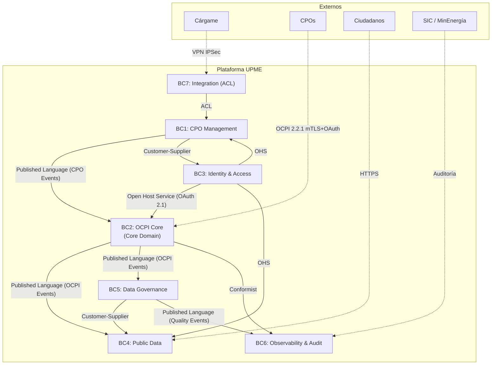
```mermaid
graph TB
    subgraph "Plataforma UPME"
        BC1["BC1: CPO Management"]
        BC2["BC2: OCPI Core<br/>(Core Domain)"]
        BC3["BC3: Identity & Access"]
        BC4["BC4: Public Data"]
        BC5["BC5: Data Governance"]
        BC6["BC6: Observability & Audit"]
        BC7["BC7: Integration (ACL)"]
    end

    subgraph "Externos"
        EXT1["Cárgame"]
        EXT2["CPOs"]
        EXT3["Ciudadanos"]
        EXT4["SIC / MinEnergía"]
    end

    BC1 -->|"Published Language (CPO Events)"| BC2
    BC1 -->|"Customer-Supplier"| BC3
    BC2 -->|"Published Language (OCPI Events)"| BC4
    BC2 -->|"Published Language (OCPI Events)"| BC5
    BC2 -->|"Conformist"| BC6
    BC3 -->|"Open Host Service (OAuth 2.1)"| BC2
    BC3 -->|"OHS"| BC4
    BC3 -->|"OHS"| BC1
    BC5 -->|"Customer-Supplier"| BC4
    BC5 -->|"Published Language (Quality Events)"| BC6
    BC7 -->|"ACL"| BC1

    EXT1 -.->|"VPN IPSec"| BC7
    EXT2 -.->|"OCPI 2.2.1 mTLS+OAuth"| BC2
    EXT3 -.->|"HTTPS"| BC4
    EXT4 -.->|"Auditoría"| BC6
```

### 1.3 Relaciones DDD

| Upstream → Downstream | Patrón | Descripción |
|----------------------|--------|-------------|
| BC3 → BC2 | **Open Host Service** | KeyCloak expone OAuth 2.1/JWT como servicio estándar |
| BC1 → BC2 | **Published Language** | Eventos CPOCertified, CPOSuspended via Kafka |
| BC2 → BC4 | **Published Language** | LocationUpdated, PriceChanged via Kafka |
| BC2 → BC5 | **Published Language** | Todos los eventos OCPI fluyen al Data Lake |
| BC7 → BC1 | **Anti-Corruption Layer** | Adapta modelo Cárgame al modelo interno CPO |
| BC5 → BC6 | **Published Language** | Eventos de calidad alimentan alertas |

---

## 2. C4 Nivel 1 — System Context

### 2.1 Structurizr DSL

```structurizr
workspace "UPME Interoperabilidad" {
    !identifiers hierarchical

    model {
        cpo = person "CPO" "Operador de Puntos de Carga — Reporta OCPI 2.2.1 RT"
        msp = person "MSP" "Proveedor de servicios de movilidad eléctrica"
        citizen = person "Ciudadano" "Usuario final — consulta precios, disponibilidad"
        upmeAdmin = person "Admin UPME" "Equipo IT (8 pers.) — administra plataforma"
        minEnergia = person "MinEnergía" "Regulador — vigilancia integridad datos"
        sic = person "SIC" "Superintendencia — protección consumidor, auditoría"
        creg = person "CREG" "Comisión Regulación Energía y Gas"

        cargame = softwareSystem "Cárgame" "Registro y habilitación de CPOs" "External"
        ldapAd = softwareSystem "LDAP/AD UPME" "Directorio corporativo" "External"

        upme = softwareSystem "Plataforma Interoperabilidad UPME" {
            description "OCPI 2.2.1 | Resolución 40559/2025 | 21.6M+ tx/mes"
        }

        cpo -> upme "Reporta datos OCPI" "HTTPS+mTLS+OAuth2.1+DPoP"
        msp -> upme "Consulta red de estaciones" "HTTPS+OAuth2.1"
        citizen -> upme "Consulta pública RT" "HTTPS (Open Data)"
        upmeAdmin -> upme "Administra, monitorea" "HTTPS+OAuth2.1+PKCE+MFA"
        minEnergia -> upme "Vigilancia datos" "HTTPS+OAuth2.1"
        sic -> upme "Auditoría consumidor" "HTTPS (sic:audit)"
        creg -> upme "Reportes tarifarios" "SFTP/API"
        upme -> cargame "Valida CPOs" "VPN IPSec IKEv2"
        upme -> ldapAd "Autentica internos" "LDAPS"
        cpo -> cargame "Pre-registro" "Portal Web"
    }

    views {
        systemContext upme "SystemContext" {
            include *
            autoLayout
            title "C4 Nivel 1 — System Context"
        }
        styles {
            element "External" {
                background #999999
                color #ffffff
            }
            element "Software System" {
                background #1168bd
                color #ffffff
            }
            element "Person" {
                background #08427b
                color #ffffff
                shape Person
            }
        }
    }
}
```

---

## 3. C4 Nivel 2 — Container Diagram

### 3.1 Inventario de Containers por Bounded Context

#### BC1: CPO Management
| Container | Tecnología | Responsabilidad |
|-----------|-----------|-----------------|
| **CPO Management Service** | Go 1.22+ | Ciclo de vida CPOs: registro, validación Cárgame, credenciales, certificación, suspensión |
| **Developer Portal** | React 18 + TS | Portal CPOs: registro, Swagger UI/Redoc, gestión credenciales, métricas |
| **Compliance Test Suite** | Go 1.22+ + k6 | Batería automatizada de pruebas OCPI 2.2.1 para certificación |

#### BC2: OCPI Core (Core Domain)
| Container | Tecnología | Responsabilidad |
|-----------|-----------|-----------------|
| **API Gateway** | OCI API GW / Kong | Punto de entrada: mTLS, JWT/DPoP, rate limiting, routing, correlation ID |
| **Ingesta Service** | Go 1.22+ | Alta concurrencia, validación schema, enriquecimiento, publicación a Kafka. < 100ms P99 |
| **OCPI Validator** | Python 3.12+ | Validación profunda: business rules, cross-field, data quality. Consumer Kafka |
| **Query Service** | Go 1.22+ | CQRS read-side: consultas de CPOs sobre sus datos, históricos |
| **Command Service** | Go 1.22+ | Comandos OCPI (start/stop charging), webhooks bidireccionales |

#### BC3: Identity & Access
| Container | Tecnología | Responsabilidad |
|-----------|-----------|-----------------|
| **KeyCloak** | KeyCloak 24+ (Quarkus) | IdP: OAuth 2.1 (PKCE, DPoP), mTLS cert-bound (RFC 8705), multi-realm, RBAC |
| **Certificate Manager** | Go 1.22+ + OCI Certs | Emisión, rotación, revocación certificados X.509. CA propia UPME |

#### BC4: Public Data
| Container | Tecnología | Responsabilidad |
|-----------|-----------|-----------------|
| **Public API Service** | Go 1.22+ | Open Data API: estaciones, precios, disponibilidad RT. Heavy caching |
| **Portal Público Web** | React 18 + Leaflet | Mapa interactivo estaciones, precios RT, filtros. Mandato 90 días (Abr 2026) |

#### BC5: Data Governance
| Container | Tecnología | Responsabilidad |
|-----------|-----------|-----------------|
| **Data Lake** | OCI Object Storage | Medallion: Bronze (crudo inmutable) → Silver (validado) → Gold (agregado) |
| **ETL Pipeline** | OCI Data Flow (Spark) | Transformaciones batch/micro-batch entre tiers |
| **Data Catalog** | OCI Data Catalog | Clasificación PII (Ley 1581), linaje, glossario, retención |
| **Data Quality Engine** | Python 3.12+ | Freshness, volumen, schema, completeness, consistency, anomalías |

#### BC6: Observability & Audit
| Container | Tecnología | Responsabilidad |
|-----------|-----------|-----------------|
| **Monitoring & Alerting** | Prometheus + Grafana + PagerDuty | RED/USE métricas, dashboards, SLO tracking, error budgets |
| **Logging & Analytics** | OCI Logging / ELK | Logs JSON estructurados, WORM para SIC, correlation ID |
| **Distributed Tracing** | OCI APM / Jaeger + OTel | Trazas end-to-end, W3C TraceContext |
| **Audit Trail Service** | Go 1.22+ + OCI WORM | Auditoría inmutable, exportación SIC |
| **Anomaly Detector** | Python 3.12+ (scikit-learn) | Z-score, seasonal decomposition, reglas de negocio |
| **Admin Dashboard** | React 18 + Chart.js | Centro de Control: CPOs, estaciones, sesiones, anomalías, SLA |

#### BC7: Integration
| Container | Tecnología | Responsabilidad |
|-----------|-----------|-----------------|
| **Cárgame Adapter (ACL)** | Go 1.22+ | Anti-Corruption Layer: circuit breaker, retry, cache Redis TTL 24h |
| **Webhook Dispatcher** | Go 1.22+ + OCI Functions | Push notifications a CPOs, retry exponencial, DLQ |
| **Notification Service** | Go 1.22+ + OCI Notifications | Multi-canal: email, Slack, SMS, WebSocket |

#### Infraestructura Compartida (Cross-cutting)
| Container | Tecnología | Responsabilidad |
|-----------|-----------|-----------------|
| **Event Streaming** | OCI Streaming (Kafka) | Bus de eventos: topics por dominio, retención 7d, DLQ |
| **Redis Cache** | Redis 7+ (OCI Cache) | Cárgame TTL 24h, OCPI state 60s, rate limiting, response cache 30s |
| **Operational DB** | OCI Autonomous DB (ATP) | Datos operacionales, Data Guard HA, autonomous scaling |
| **TimeSeries DB** | TimescaleDB sobre OKE | Métricas telemetría, histórico precios, tendencias |
| **CDC Pipeline** | OCI GoldenGate | Change Data Capture: DB → Data Lake RT |
| **Vault** | OCI Vault (HSM FIPS 140-2 L3) | Secrets, API keys, claves JWT RSA, CA certs |
| **WAF** | OCI WAF | OWASP Top 10, DDoS L7, bot detection, geo-IP |

### 3.2 Structurizr DSL — Container Diagram

```structurizr
workspace "UPME Containers" {
    !identifiers hierarchical

    model {
        cpo = person "CPO" "Operador de Puntos de Carga"
        citizen = person "Ciudadano" "Usuario final"
        admin = person "Admin UPME" "Equipo IT"
        sic = person "SIC" "Auditoría"

        cargame = softwareSystem "Cárgame" "Registro CPOs" "External"
        ldap = softwareSystem "LDAP/AD" "Directorio UPME" "External"

        upme = softwareSystem "Plataforma UPME" {

            // BC1: CPO Management
            cpoSvc = container "CPO Management Service" "Go 1.22+" "Ciclo de vida CPOs"
            devPortal = container "Developer Portal" "React 18+TS" "Portal CPOs"
            compliance = container "Compliance Suite" "Go+k6" "Tests OCPI 2.2.1"

            // BC2: OCPI Core
            gw = container "API Gateway" "OCI API GW/Kong" "mTLS,JWT,Rate Limit,Routing"
            ingest = container "Ingesta Service" "Go 1.22+" "Alta concurrencia, <100ms P99"
            validator = container "OCPI Validator" "Python 3.12+" "Business rules validation"
            query = container "Query Service" "Go 1.22+" "CQRS read-side"
            cmd = container "Command Service" "Go 1.22+" "OCPI Commands"

            // BC3: Identity
            kc = container "KeyCloak" "KeyCloak 24+" "OAuth2.1, PKCE, DPoP, mTLS, RBAC"
            certMgr = container "Certificate Manager" "Go+OCI Certs" "X.509 lifecycle"

            // BC4: Public Data
            pubApi = container "Public API Service" "Go 1.22+" "Open Data API RT"
            pubPortal = container "Portal Público" "React+Leaflet" "Mapa estaciones RT"

            // BC5: Data Governance
            lake = container "Data Lake" "OCI Object Storage" "Bronze→Silver→Gold"
            etl = container "ETL Pipeline" "OCI Data Flow/Spark" "Transformaciones"
            catalog = container "Data Catalog" "OCI Data Catalog" "PII, linaje"
            dqEngine = container "Data Quality Engine" "Python 3.12+" "Freshness, anomalías"

            // BC6: Observability
            monitor = container "Monitoring" "Prometheus+Grafana" "RED/USE, SLOs"
            logging = container "Logging" "OCI Logging/ELK" "Logs WORM"
            tracing = container "Tracing" "OCI APM/Jaeger" "Distributed traces"
            audit = container "Audit Service" "Go+WORM" "Auditoría SIC"
            anomaly = container "Anomaly Detector" "Python+sklearn" "Z-score, seasonal"
            dashboard = container "Admin Dashboard" "React+Chart.js" "Centro de Control"

            // BC7: Integration
            acl = container "Cárgame Adapter" "Go 1.22+" "ACL, circuit breaker"
            webhook = container "Webhook Dispatcher" "Go+OCI Functions" "Push CPOs"
            notif = container "Notification Service" "Go+OCI Notif" "Email,Slack,SMS,WS"

            // Shared
            kafka = container "Event Streaming" "OCI Streaming/Kafka" "Bus de eventos"
            redis = container "Redis Cache" "Redis 7+" "Multi-purpose cache"
            db = container "Operational DB" "OCI Autonomous ATP" "Datos operacionales"
            tsdb = container "TimeSeries DB" "TimescaleDB" "Métricas, históricos"
            cdc = container "CDC Pipeline" "OCI GoldenGate" "DB→Lake RT"
            vault = container "Vault" "OCI Vault HSM" "Secrets, keys"
            waf = container "WAF" "OCI WAF" "OWASP, DDoS L7"
        }

        // Flujo CPO → Plataforma
        cpo -> upme.waf "OCPI Requests" "HTTPS"
        upme.waf -> upme.gw "Filtered traffic" "HTTPS"
        upme.gw -> upme.kc "Validate JWT+DPoP" "HTTPS"
        upme.gw -> upme.ingest "Write requests" "gRPC"
        upme.gw -> upme.query "Read requests" "gRPC"
        upme.gw -> upme.cmd "Commands" "gRPC"
        upme.gw -> upme.redis "Rate limit" "Redis"
        upme.gw -> upme.pubApi "Public routes" "HTTPS"

        // Ingesta pipeline
        upme.ingest -> upme.redis "Cache lookup" "Redis"
        upme.ingest -> upme.kafka "Publish OCPI events" "Kafka"
        upme.ingest -> upme.db "Persist state" "SQL/TLS"
        upme.validator -> upme.kafka "Consume OCPI events" "Kafka"
        upme.validator -> upme.db "Update validation" "SQL/TLS"
        upme.validator -> upme.kafka "Publish results" "Kafka"

        // Query (CQRS)
        upme.query -> upme.db "Read data" "SQL/TLS"
        upme.query -> upme.redis "Response cache" "Redis"
        upme.query -> upme.tsdb "Read timeseries" "SQL"

        // CPO Management
        upme.cpoSvc -> upme.acl "Validate CPO" "gRPC"
        upme.cpoSvc -> upme.kc "Create credentials" "Admin API"
        upme.cpoSvc -> upme.certMgr "Issue X.509" "HTTPS"
        upme.cpoSvc -> upme.db "CRUD CPO" "SQL/TLS"
        upme.cpoSvc -> upme.kafka "CPO events" "Kafka"
        upme.devPortal -> upme.cpoSvc "Registration" "HTTPS"
        upme.compliance -> upme.gw "OCPI tests" "HTTPS+mTLS"

        // Integration
        upme.acl -> cargame "Query CPO status" "VPN IPSec+REST"
        upme.acl -> upme.redis "Cache Cárgame 24h" "Redis"

        // Public Data
        upme.pubApi -> upme.db "Read public data" "SQL/TLS"
        upme.pubApi -> upme.redis "Response cache 30s" "Redis"
        citizen -> upme.waf "Public queries" "HTTPS"
        upme.pubPortal -> upme.pubApi "Fetch stations" "HTTPS"

        // Data Governance
        upme.kafka -> upme.lake "Persist Bronze" "Kafka Connect"
        upme.cdc -> upme.db "CDC extract" "LogMiner"
        upme.cdc -> upme.lake "Replicate" "OCI SDK"
        upme.etl -> upme.lake "Transform B→S→G" "Spark"
        upme.catalog -> upme.lake "Catalog data" "OCI SDK"
        upme.dqEngine -> upme.lake "Evaluate quality" "Spark"
        upme.dqEngine -> upme.kafka "Quality events" "Kafka"

        // Observability
        upme.ingest -> upme.tracing "Traces" "OTLP"
        upme.validator -> upme.tracing "Traces" "OTLP"
        upme.ingest -> upme.logging "Logs" "Fluentd"
        upme.anomaly -> upme.monitor "Anomaly alerts" "Prometheus"
        upme.audit -> upme.kafka "Consume audit" "Kafka"
        upme.audit -> upme.lake "Persist WORM" "OCI SDK"
        admin -> upme.dashboard "Operate platform" "HTTPS"
        upme.dashboard -> upme.query "Data queries" "HTTPS"
        sic -> upme.audit "Audit access" "HTTPS"

        // Webhooks
        upme.webhook -> upme.kafka "Consume events" "Kafka"
        upme.webhook -> cpo "Push notifications" "HTTPS Webhook"
        upme.notif -> admin "Ops alerts" "Email/Slack"

        // Security
        upme.kc -> ldap "LDAP federation" "LDAPS"
        upme.kc -> upme.vault "JWT signing keys" "Vault API"
        upme.certMgr -> upme.vault "CA keys" "Vault API"
    }

    views {
        container upme "Containers" {
            include *
            autoLayout tb
            title "C4 Nivel 2 — Container Diagram"
        }
        styles {
            element "External" {
                background #999999
                color #ffffff
            }
            element "Container" {
                background #438dd5
                color #ffffff
            }
            element "Person" {
                background #08427b
                color #ffffff
                shape Person
            }
        }
    }
}
```

### 3.3 Container Diagram (Mermaid — Vista Simplificada)

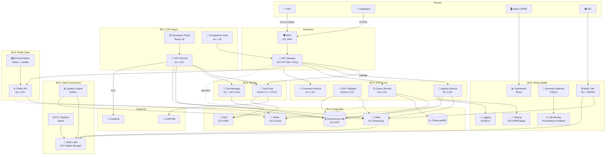
```mermaid
graph TB
    subgraph "Actores"
        CPO["⚡ CPO"]
        CIT["👤 Ciudadano"]
        ADM["🖥️ Admin UPME"]
        RSIC["🏛️ SIC"]
    end

    subgraph "Perímetro"
        WAF["🛡️ WAF<br/>OCI WAF"]
        GW["🚪 API Gateway<br/>OCI API GW / Kong"]
    end

    subgraph "BC2: OCPI Core"
        ING["📡 Ingesta Service<br/>Go 1.22+"]
        VAL["✅ OCPI Validator<br/>Python 3.12+"]
        QRY["🔍 Query Service<br/>Go 1.22+"]
        CMD["⚡ Command Service<br/>Go 1.22+"]
    end

    subgraph "BC3: Identity"
        KC["🔐 KeyCloak<br/>OAuth 2.1 + mTLS"]
        CERT["📜 Cert Manager<br/>Go + OCI Certs"]
    end

    subgraph "BC1: CPO Mgmt"
        CPOSVC["🏢 CPO Service<br/>Go 1.22+"]
        DEVP["📋 Developer Portal<br/>React 18"]
        COMP["🧪 Compliance Suite<br/>Go + k6"]
    end

    subgraph "BC4: Public Data"
        PAPI["🌐 Public API<br/>Go 1.22+"]
        PPOR["🗺️ Portal Público<br/>React + Leaflet"]
    end

    subgraph "BC5: Data Governance"
        LAKE["💾 Data Lake<br/>OCI Object Storage"]
        ETL["⚙️ ETL Pipeline<br/>Spark"]
        DQ["📊 Quality Engine<br/>Python"]
    end

    subgraph "BC6: Observability"
        MON["📈 Monitoring<br/>Prometheus+Grafana"]
        LOG["📝 Logging<br/>OCI/ELK"]
        TRC["🔗 Tracing<br/>OCI APM/Jaeger"]
        AUD["🔒 Audit Trail<br/>Go + WORM"]
        ANOM["🔮 Anomaly Detector<br/>Python"]
        DASH["📊 Dashboard<br/>React"]
    end

    subgraph "Infra Compartida"
        KFK["📨 Kafka<br/>OCI Streaming"]
        RED["⚡ Redis<br/>OCI Cache"]
        DB[("🗄️ Autonomous DB<br/>OCI ATP")]
        TSDB[("📉 TimescaleDB")]
        VLT["🔑 Vault<br/>OCI HSM"]
    end

    subgraph "Externos"
        CARG["🏢 Cárgame"]
        LDAP["📁 LDAP/AD"]
    end

    CPO -->|mTLS+OAuth| WAF
    CIT -->|HTTPS| WAF
    WAF --> GW
    GW -->|validate| KC
    GW --> ING
    GW --> QRY
    GW --> CMD
    GW --> PAPI
    GW -.->|rate limit| RED

    ING --> KFK
    ING --> DB
    ING -.-> RED
    VAL --> KFK
    VAL --> DB
    QRY --> DB
    QRY --> TSDB
    QRY -.-> RED

    CPOSVC --> KC
    CPOSVC --> CERT
    CPOSVC --> DB
    CPOSVC --> KFK
    DEVP --> CPOSVC
    COMP --> GW

    PAPI --> DB
    PAPI -.-> RED
    PPOR --> PAPI

    KFK --> LAKE
    ETL --> LAKE
    DQ --> LAKE
    DQ --> KFK

    ING --> TRC
    ING --> LOG
    ANOM --> MON
    AUD --> KFK
    AUD --> LAKE
    ADM --> DASH
    RSIC --> AUD

    CPOSVC -->|ACL| CARG
    KC --> LDAP
    KC --> VLT
    CERT --> VLT
```

---

## 4. C4 Nivel 3 — Component Diagrams

### 4.1 BC1: CPO Management — Components

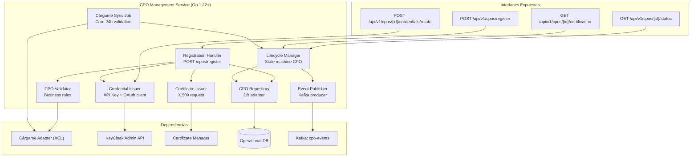
```mermaid
graph TB
    subgraph "CPO Management Service (Go 1.22+)"
        REG["Registration Handler<br/>POST /cpos/register"]
        VALID["CPO Validator<br/>Business rules"]
        CRED["Credential Issuer<br/>API Key + OAuth client"]
        CERT_I["Certificate Issuer<br/>X.509 request"]
        LIFE["Lifecycle Manager<br/>State machine CPO"]
        SYNC["Cárgame Sync Job<br/>Cron 24h validation"]
        REPO_CPO["CPO Repository<br/>DB adapter"]
        EVT_PUB["Event Publisher<br/>Kafka producer"]
    end

    subgraph "Interfaces Expuestas"
        API_REG["POST /api/v1/cpos/register"]
        API_STATUS["GET /api/v1/cpos/{id}/status"]
        API_CREDS["POST /api/v1/cpos/{id}/credentials/rotate"]
        API_CERT["GET /api/v1/cpos/{id}/certification"]
    end

    subgraph "Dependencias"
        ACL_C["Cárgame Adapter (ACL)"]
        KC_ADM["KeyCloak Admin API"]
        CERT_MGR["Certificate Manager"]
        DB_CPO[("Operational DB")]
        KFK_CPO["Kafka: cpo-events"]
    end

    API_REG --> REG
    API_STATUS --> LIFE
    API_CREDS --> CRED
    API_CERT --> LIFE

    REG --> VALID
    VALID --> ACL_C
    REG --> CRED
    CRED --> KC_ADM
    REG --> CERT_I
    CERT_I --> CERT_MGR
    REG --> REPO_CPO
    LIFE --> REPO_CPO
    LIFE --> EVT_PUB
    SYNC --> ACL_C
    SYNC --> LIFE
    REPO_CPO --> DB_CPO
    EVT_PUB --> KFK_CPO
```

**Componentes internos del CPO Management Service:**

| Componente | Responsabilidad | Patrón |
|------------|----------------|--------|
| **Registration Handler** | Recibe solicitud de registro, orquesta flujo completo | Application Service |
| **CPO Validator** | Valida NIT, estado en Cárgame, documentación | Domain Service |
| **Credential Issuer** | Genera API Key (UUID v4 + hash SHA-256), crea client OAuth en KC | Domain Service |
| **Certificate Issuer** | Solicita emisión de cert X.509 a Certificate Manager | Domain Service |
| **Lifecycle Manager** | State machine: Registered → Validating → Credentialed → Testing → Certified → Production → Suspended | Aggregate Root Logic |
| **Cárgame Sync Job** | Job periódico (24h): re-valida estado de todos los CPOs activos contra Cárgame | Scheduled Job |
| **CPO Repository** | Persistencia del aggregate CPO | Repository |
| **Event Publisher** | Publica Domain Events a Kafka (CPORegistered, CPOCertified, CPOSuspended) | Event Publisher |

---

### 4.2 BC2: OCPI Core — Components

#### 4.2.1 Ingesta Service (Go)

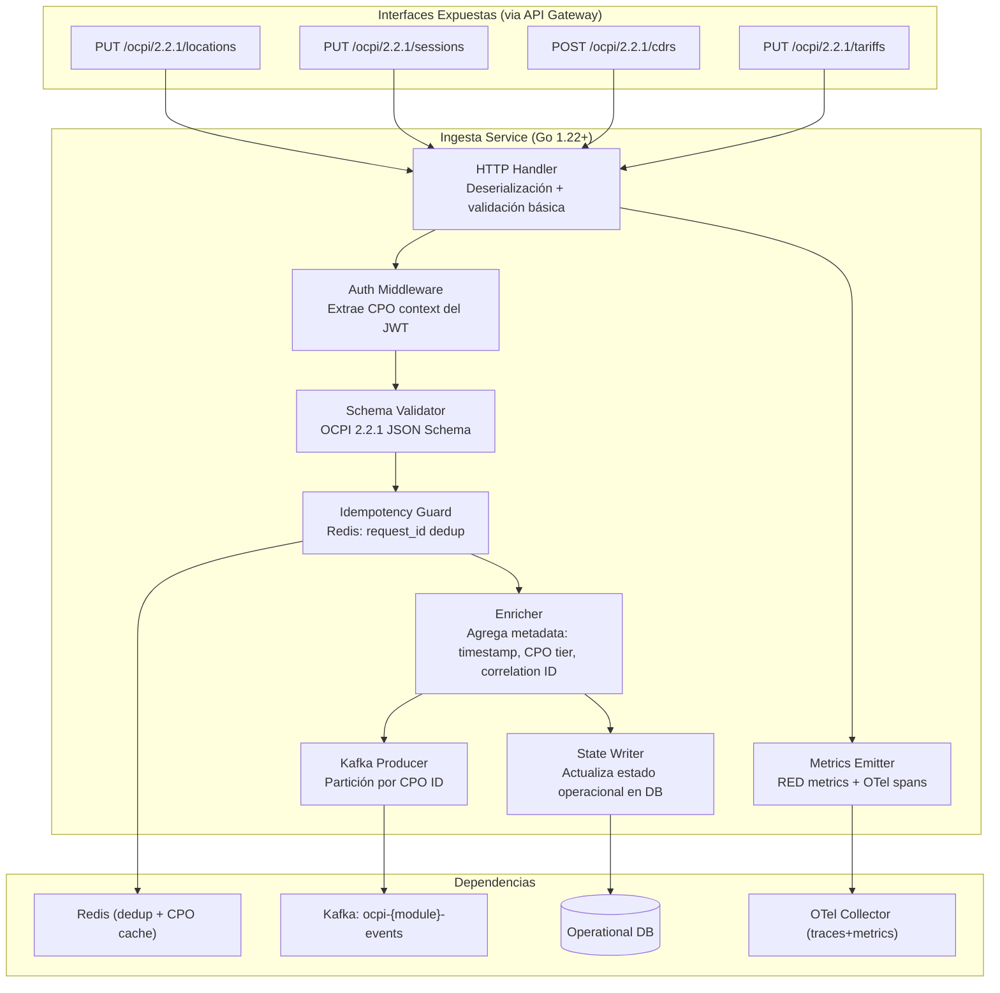
```mermaid
graph TB
    subgraph "Ingesta Service (Go 1.22+)"
        HTTP_H["HTTP Handler<br/>Deserialización + validación básica"]
        AUTH_MW["Auth Middleware<br/>Extrae CPO context del JWT"]
        SCHEMA["Schema Validator<br/>OCPI 2.2.1 JSON Schema"]
        ENRICH["Enricher<br/>Agrega metadata: timestamp, CPO tier, correlation ID"]
        IDEMP["Idempotency Guard<br/>Redis: request_id dedup"]
        PRODUCER["Kafka Producer<br/>Partición por CPO ID"]
        STATE["State Writer<br/>Actualiza estado operacional en DB"]
        METRIC["Metrics Emitter<br/>RED metrics + OTel spans"]
    end

    subgraph "Interfaces Expuestas (via API Gateway)"
        PUT_LOC["PUT /ocpi/2.2.1/locations"]
        PUT_SES["PUT /ocpi/2.2.1/sessions"]
        POST_CDR["POST /ocpi/2.2.1/cdrs"]
        PUT_TAR["PUT /ocpi/2.2.1/tariffs"]
    end

    subgraph "Dependencias"
        REDIS_I["Redis (dedup + CPO cache)"]
        KFK_OCPI["Kafka: ocpi-{module}-events"]
        DB_STATE[("Operational DB")]
        OTEL["OTel Collector (traces+metrics)"]
    end

    PUT_LOC --> HTTP_H
    PUT_SES --> HTTP_H
    POST_CDR --> HTTP_H
    PUT_TAR --> HTTP_H

    HTTP_H --> AUTH_MW
    AUTH_MW --> SCHEMA
    SCHEMA --> IDEMP
    IDEMP --> REDIS_I
    IDEMP --> ENRICH
    ENRICH --> PRODUCER
    ENRICH --> STATE
    PRODUCER --> KFK_OCPI
    STATE --> DB_STATE
    HTTP_H --> METRIC
    METRIC --> OTEL
```

#### 4.2.2 OCPI Validator Service (Python)

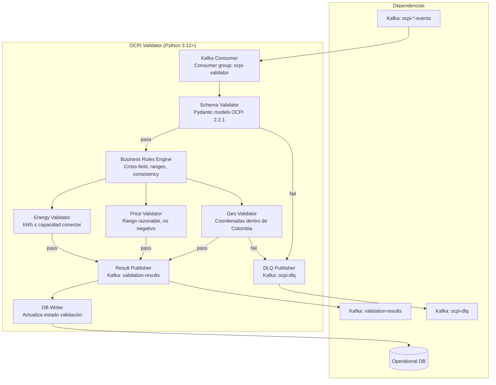
```mermaid
graph TB
    subgraph "OCPI Validator (Python 3.12+)"
        CONSUMER["Kafka Consumer<br/>Consumer group: ocpi-validator"]
        SCHEMA_V["Schema Validator<br/>Pydantic models OCPI 2.2.1"]
        BIZ_RULES["Business Rules Engine<br/>Cross-field, ranges, consistency"]
        GEO_V["Geo Validator<br/>Coordenadas dentro de Colombia"]
        PRICE_V["Price Validator<br/>Rango razonable, no negativo"]
        ENERGY_V["Energy Validator<br/>kWh ≤ capacidad conector"]
        RESULT_PUB["Result Publisher<br/>Kafka: validation-results"]
        DLQ_PUB["DLQ Publisher<br/>Kafka: ocpi-dlq"]
        DB_W["DB Writer<br/>Actualiza estado validación"]
    end

    subgraph "Dependencias"
        KFK_IN["Kafka: ocpi-*-events"]
        KFK_OUT["Kafka: validation-results"]
        KFK_DLQ["Kafka: ocpi-dlq"]
        DB_V[("Operational DB")]
    end

    KFK_IN --> CONSUMER
    CONSUMER --> SCHEMA_V
    SCHEMA_V -->|pass| BIZ_RULES
    SCHEMA_V -->|fail| DLQ_PUB
    BIZ_RULES --> GEO_V
    BIZ_RULES --> PRICE_V
    BIZ_RULES --> ENERGY_V
    GEO_V -->|pass| RESULT_PUB
    PRICE_V -->|pass| RESULT_PUB
    ENERGY_V -->|pass| RESULT_PUB
    GEO_V -->|fail| DLQ_PUB
    RESULT_PUB --> KFK_OUT
    RESULT_PUB --> DB_W
    DLQ_PUB --> KFK_DLQ
    DB_W --> DB_V
```

#### 4.2.3 Query Service (Go) — CQRS Read Side

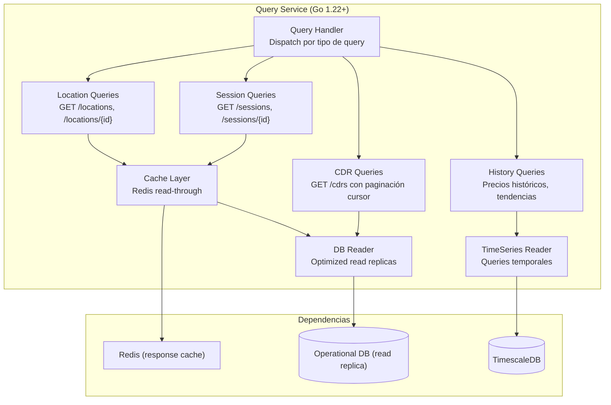
```mermaid
graph TB
    subgraph "Query Service (Go 1.22+)"
        Q_HANDLER["Query Handler<br/>Dispatch por tipo de query"]
        LOC_Q["Location Queries<br/>GET /locations, /locations/{id}"]
        SES_Q["Session Queries<br/>GET /sessions, /sessions/{id}"]
        CDR_Q["CDR Queries<br/>GET /cdrs con paginación cursor"]
        HIST_Q["History Queries<br/>Precios históricos, tendencias"]
        CACHE_L["Cache Layer<br/>Redis read-through"]
        DB_READ["DB Reader<br/>Optimized read replicas"]
        TS_READ["TimeSeries Reader<br/>Queries temporales"]
    end

    subgraph "Dependencias"
        REDIS_Q["Redis (response cache)"]
        DB_Q[("Operational DB (read replica)")]
        TSDB_Q[("TimescaleDB")]
    end

    Q_HANDLER --> LOC_Q
    Q_HANDLER --> SES_Q
    Q_HANDLER --> CDR_Q
    Q_HANDLER --> HIST_Q
    LOC_Q --> CACHE_L
    SES_Q --> CACHE_L
    CDR_Q --> DB_READ
    HIST_Q --> TS_READ
    CACHE_L --> REDIS_Q
    CACHE_L --> DB_READ
    DB_READ --> DB_Q
    TS_READ --> TSDB_Q
```

---

### 4.3 BC3: Identity & Access — Components

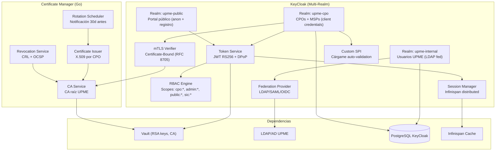
```mermaid
graph TB
    subgraph "KeyCloak (Multi-Realm)"
        REALM_INT["Realm: upme-internal<br/>Usuarios UPME (LDAP fed)"]
        REALM_CPO["Realm: upme-cpo<br/>CPOs + MSPs (client credentials)"]
        REALM_PUB["Realm: upme-public<br/>Portal público (anon + registro)"]
        TOKEN_SVC["Token Service<br/>JWT RS256 + DPoP"]
        MTLS_V["mTLS Verifier<br/>Certificate-Bound (RFC 8705)"]
        RBAC_E["RBAC Engine<br/>Scopes: cpo:*, admin:*, public:*, sic:*"]
        FED["Federation Provider<br/>LDAP/SAML/OIDC"]
        SPI["Custom SPI<br/>Cárgame auto-validation"]
        SESSION["Session Manager<br/>Infinispan distributed"]
    end

    subgraph "Certificate Manager (Go)"
        CA["CA Service<br/>CA raíz UPME"]
        ISSUE["Certificate Issuer<br/>X.509 por CPO"]
        REVOKE["Revocation Service<br/>CRL + OCSP"]
        ROTATE["Rotation Scheduler<br/>Notificación 30d antes"]
    end

    subgraph "Dependencias"
        VLT_ID["Vault (RSA keys, CA)"]
        LDAP_ID["LDAP/AD UPME"]
        DB_KC[("PostgreSQL KeyCloak")]
        INFINI["Infinispan Cache"]
    end

    REALM_INT --> FED
    FED --> LDAP_ID
    REALM_CPO --> MTLS_V
    REALM_CPO --> TOKEN_SVC
    REALM_CPO --> SPI
    REALM_PUB --> TOKEN_SVC
    TOKEN_SVC --> VLT_ID
    TOKEN_SVC --> RBAC_E
    TOKEN_SVC --> SESSION
    SESSION --> INFINI
    MTLS_V --> CA

    CA --> VLT_ID
    ISSUE --> CA
    REVOKE --> CA
    ROTATE --> ISSUE
    
    REALM_INT --> DB_KC
    REALM_CPO --> DB_KC
```

---

### 4.4 BC4: Public Data — Components

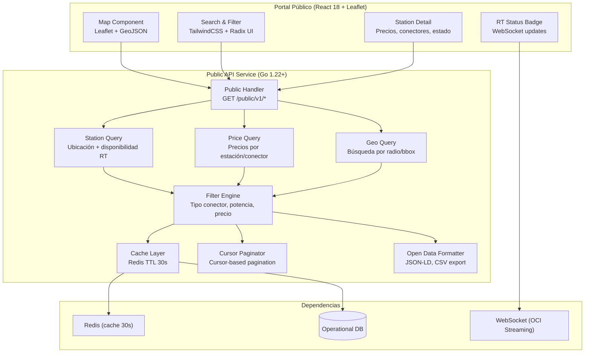
```mermaid
graph TB
    subgraph "Public API Service (Go 1.22+)"
        PUB_HANDLER["Public Handler<br/>GET /public/v1/*"]
        STATION_Q["Station Query<br/>Ubicación + disponibilidad RT"]
        PRICE_Q["Price Query<br/>Precios por estación/conector"]
        GEO_Q["Geo Query<br/>Búsqueda por radio/bbox"]
        FILTER["Filter Engine<br/>Tipo conector, potencia, precio"]
        CACHE_PUB["Cache Layer<br/>Redis TTL 30s"]
        PAGINATOR["Cursor Paginator<br/>Cursor-based pagination"]
        OPENDATA["Open Data Formatter<br/>JSON-LD, CSV export"]
    end

    subgraph "Portal Público (React 18 + Leaflet)"
        MAP["Map Component<br/>Leaflet + GeoJSON"]
        SEARCH["Search & Filter<br/>TailwindCSS + Radix UI"]
        DETAIL["Station Detail<br/>Precios, conectores, estado"]
        RT_BADGE["RT Status Badge<br/>WebSocket updates"]
    end

    subgraph "Dependencias"
        REDIS_P["Redis (cache 30s)"]
        DB_P[("Operational DB")]
        WS["WebSocket (OCI Streaming)"]
    end

    PUB_HANDLER --> STATION_Q
    PUB_HANDLER --> PRICE_Q
    PUB_HANDLER --> GEO_Q
    STATION_Q --> FILTER
    PRICE_Q --> FILTER
    GEO_Q --> FILTER
    FILTER --> CACHE_PUB
    FILTER --> PAGINATOR
    FILTER --> OPENDATA
    CACHE_PUB --> REDIS_P
    CACHE_PUB --> DB_P

    MAP --> PUB_HANDLER
    SEARCH --> PUB_HANDLER
    DETAIL --> PUB_HANDLER
    RT_BADGE --> WS
```

---

### 4.5 BC5: Data Governance — Components


```mermaid
graph TB
    subgraph "Data Lake (Medallion Architecture)"
        BRONZE["Bronze Layer<br/>Datos crudos inmutables<br/>Partición: date/cpo_id/module"]
        SILVER["Silver Layer<br/>Datos validados, dedup,<br/>enriquecidos, tipados"]
        GOLD["Gold Layer<br/>Agregaciones, KPIs,<br/>reportes regulatorios"]
    end

    subgraph "ETL Pipeline (Spark)"
        B2S["Bronze → Silver<br/>Limpieza, dedup, schema enforcement"]
        S2G["Silver → Gold<br/>Agregación horaria/diaria,<br/>métricas por CPO/región"]
        REG_RPT["Regulatory Reports<br/>MinEnergía, SIC, CREG"]
    end

    subgraph "Data Quality Engine (Python)"
        FRESH["Freshness Monitor<br/>¿Datos < 5 min?"]
        VOL["Volume Monitor<br/>±2σ baseline"]
        SCHEMA_Q["Schema Check<br/>OCPI 2.2.1 compliance"]
        COMPLETE["Completeness Check<br/>Campos obligatorios"]
        CONSIST["Consistency Check<br/>Histórico vs actual"]
        ANOMALY_D["Anomaly Detector<br/>Z-score, seasonal"]
    end

    subgraph "Data Catalog (OCI)"
        CLASS["Data Classifier<br/>PII (Ley 1581), público, interno"]
        LINEAGE["Lineage Tracker<br/>Origen → transformación → destino"]
        GLOSS["Business Glossary<br/>Términos OCPI + regulatorios"]
        RETENTION["Retention Manager<br/>Bronze 7y, Silver 5y, Gold 10y"]
    end

    subgraph "Dependencias"
        KFK_DG["Kafka (OCPI events)"]
        CDC_DG["GoldenGate (CDC)"]
        KFK_QE["Kafka: quality-events"]
        OBJ["OCI Object Storage"]
    end

    KFK_DG --> BRONZE
    CDC_DG --> BRONZE
    BRONZE --> OBJ
    B2S --> BRONZE
    B2S --> SILVER
    SILVER --> OBJ
    S2G --> SILVER
    S2G --> GOLD
    GOLD --> OBJ
    REG_RPT --> GOLD

    FRESH --> SILVER
    VOL --> SILVER
    SCHEMA_Q --> SILVER
    COMPLETE --> SILVER
    CONSIST --> SILVER
    ANOMALY_D --> SILVER
    ANOMALY_D --> KFK_QE

    CLASS --> SILVER
    LINEAGE --> BRONZE
    LINEAGE --> SILVER
    LINEAGE --> GOLD
    RETENTION --> OBJ
```

---

### 4.6 BC6: Observability & Audit — Components

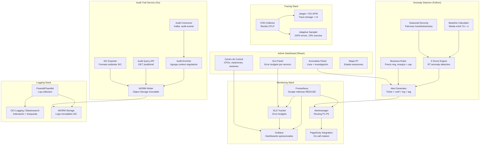
```mermaid
graph TB
    subgraph "Monitoring Stack"
        PROM["Prometheus<br/>Scrape métricas RED/USE"]
        GRAF["Grafana<br/>Dashboards operacionales"]
        ALERT["Alertmanager<br/>Routing P1-P5"]
        PD["PagerDuty Integration<br/>On-call rotation"]
        SLO_T["SLO Tracker<br/>Error budgets"]
    end

    subgraph "Logging Stack"
        FLUENT["Fluentd/Fluentbit<br/>Log collection"]
        LOG_STORE["OCI Logging / Elasticsearch<br/>Indexación + búsqueda"]
        WORM_LOG["WORM Storage<br/>Logs inmutables SIC"]
    end

    subgraph "Tracing Stack"
        OTEL_COL["OTel Collector<br/>Recibe OTLP"]
        JAEGER_S["Jaeger / OCI APM<br/>Trace storage + UI"]
        SAMPLER["Adaptive Sampler<br/>100% errors, 10% success"]
    end

    subgraph "Audit Trail Service (Go)"
        AUD_CONSUMER["Audit Consumer<br/>Kafka: audit-events"]
        AUD_ENRICHER["Audit Enricher<br/>Agrega context regulatorio"]
        AUD_WRITER["WORM Writer<br/>Object Storage inmutable"]
        AUD_EXPORTER["SIC Exporter<br/>Formato estándar SIC"]
        AUD_QUERY["Audit Query API<br/>GET /audit/trail"]
    end

    subgraph "Anomaly Detector (Python)"
        BASELINE["Baseline Calculator<br/>Media móvil 7d + σ"]
        ZSCORE["Z-Score Engine<br/>RT anomaly detection"]
        SEASONAL["Seasonal Decomp<br/>Patrones hora/día/semana"]
        BIZ_RULE_A["Business Rules<br/>Precio neg, energía > cap"]
        ALERT_GEN["Alert Generator<br/>Ticket + notif + log + tag"]
    end

    subgraph "Admin Dashboard (React)"
        CTRL["Centro de Control<br/>CPOs, estaciones, sesiones"]
        ANOM_VIEW["Anomalías Panel<br/>Lista + investigación"]
        SLA_VIEW["SLA Panel<br/>Error budgets por servicio"]
        MAP_VIEW["Mapa RT<br/>Estado estaciones"]
    end

    PROM --> GRAF
    PROM --> ALERT
    ALERT --> PD
    PROM --> SLO_T
    SLO_T --> GRAF

    FLUENT --> LOG_STORE
    FLUENT --> WORM_LOG

    OTEL_COL --> JAEGER_S
    OTEL_COL --> SAMPLER

    AUD_CONSUMER --> AUD_ENRICHER
    AUD_ENRICHER --> AUD_WRITER
    AUD_WRITER --> WORM_LOG
    AUD_QUERY --> AUD_WRITER
    AUD_EXPORTER --> AUD_WRITER

    BASELINE --> ZSCORE
    ZSCORE --> ALERT_GEN
    SEASONAL --> ZSCORE
    BIZ_RULE_A --> ALERT_GEN
    ALERT_GEN --> ALERT

    CTRL --> GRAF
    ANOM_VIEW --> ALERT_GEN
    SLA_VIEW --> SLO_T
```

---

### 4.7 BC7: Integration — Components

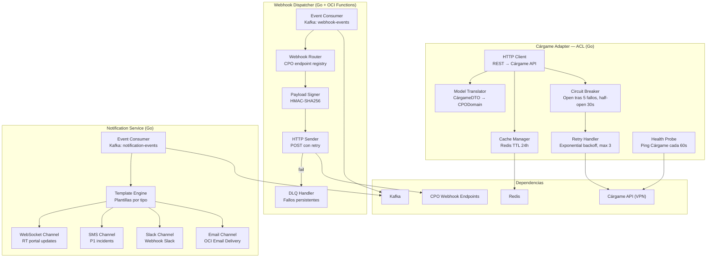
```mermaid
graph TB
    subgraph "Cárgame Adapter — ACL (Go)"
        ACL_CLIENT["HTTP Client<br/>REST → Cárgame API"]
        CIRCUIT["Circuit Breaker<br/>Open tras 5 fallos, half-open 30s"]
        RETRY["Retry Handler<br/>Exponential backoff, max 3"]
        CACHE_ACL["Cache Manager<br/>Redis TTL 24h"]
        TRANSLATOR["Model Translator<br/>CárgameDTO → CPODomain"]
        HEALTH_C["Health Probe<br/>Ping Cárgame cada 60s"]
    end

    subgraph "Webhook Dispatcher (Go + OCI Functions)"
        WH_CONSUMER["Event Consumer<br/>Kafka: webhook-events"]
        WH_ROUTER["Webhook Router<br/>CPO endpoint registry"]
        WH_SENDER["HTTP Sender<br/>POST con retry"]
        WH_DLQ["DLQ Handler<br/>Fallos persistentes"]
        WH_SIGN["Payload Signer<br/>HMAC-SHA256"]
    end

    subgraph "Notification Service (Go)"
        N_CONSUMER["Event Consumer<br/>Kafka: notification-events"]
        N_EMAIL["Email Channel<br/>OCI Email Delivery"]
        N_SLACK["Slack Channel<br/>Webhook Slack"]
        N_SMS["SMS Channel<br/>P1 incidents"]
        N_WS["WebSocket Channel<br/>RT portal updates"]
        N_TEMPLATE["Template Engine<br/>Plantillas por tipo"]
    end

    subgraph "Dependencias"
        CARG_API["Cárgame API (VPN)"]
        RED_ACL["Redis"]
        KFK_INT["Kafka"]
        CPO_EP["CPO Webhook Endpoints"]
    end

    ACL_CLIENT --> CIRCUIT
    CIRCUIT --> RETRY
    RETRY --> CARG_API
    ACL_CLIENT --> CACHE_ACL
    CACHE_ACL --> RED_ACL
    ACL_CLIENT --> TRANSLATOR
    HEALTH_C --> CARG_API

    WH_CONSUMER --> KFK_INT
    WH_CONSUMER --> WH_ROUTER
    WH_ROUTER --> WH_SIGN
    WH_SIGN --> WH_SENDER
    WH_SENDER --> CPO_EP
    WH_SENDER -->|fail| WH_DLQ

    N_CONSUMER --> KFK_INT
    N_CONSUMER --> N_TEMPLATE
    N_TEMPLATE --> N_EMAIL
    N_TEMPLATE --> N_SLACK
    N_TEMPLATE --> N_SMS
    N_TEMPLATE --> N_WS
```

---

## 5. C4 Nivel 4 — Domain Models

### 5.1 BC1: CPO Management — Aggregate & Entities

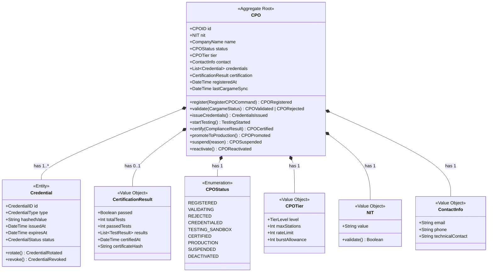
```mermaid
classDiagram
    class CPO {
        <<Aggregate Root>>
        +CPOID id
        +NIT nit
        +CompanyName name
        +CPOStatus status
        +CPOTier tier
        +ContactInfo contact
        +List~Credential~ credentials
        +CertificationResult certification
        +DateTime registeredAt
        +DateTime lastCargameSync
        +register(RegisterCPOCommand) CPORegistered
        +validate(CargameStatus) CPOValidated | CPORejected
        +issueCredentials() CredentialsIssued
        +startTesting() TestingStarted
        +certify(ComplianceResult) CPOCertified
        +promoteToProduction() CPOPromoted
        +suspend(reason) CPOSuspended
        +reactivate() CPOReactivated
    }

    class Credential {
        <<Entity>>
        +CredentialID id
        +CredentialType type
        +String hashedValue
        +DateTime issuedAt
        +DateTime expiresAt
        +CredentialStatus status
        +rotate() CredentialRotated
        +revoke() CredentialRevoked
    }

    class CertificationResult {
        <<Value Object>>
        +Boolean passed
        +Int totalTests
        +Int passedTests
        +List~TestResult~ results
        +DateTime certifiedAt
        +String certificateHash
    }

    class CPOStatus {
        <<Enumeration>>
        REGISTERED
        VALIDATING
        REJECTED
        CREDENTIALED
        TESTING_SANDBOX
        CERTIFIED
        PRODUCTION
        SUSPENDED
        DEACTIVATED
    }

    class CPOTier {
        <<Value Object>>
        +TierLevel level
        +Int maxStations
        +Int rateLimit
        +Int burstAllowance
    }

    class NIT {
        <<Value Object>>
        +String value
        +validate() Boolean
    }

    class ContactInfo {
        <<Value Object>>
        +String email
        +String phone
        +String technicalContact
    }

    CPO *-- Credential : has 1..*
    CPO *-- CertificationResult : has 0..1
    CPO *-- CPOStatus : has 1
    CPO *-- CPOTier : has 1
    CPO *-- NIT : has 1
    CPO *-- ContactInfo : has 1
```

### 5.2 BC2: OCPI Core — Aggregates & Entities

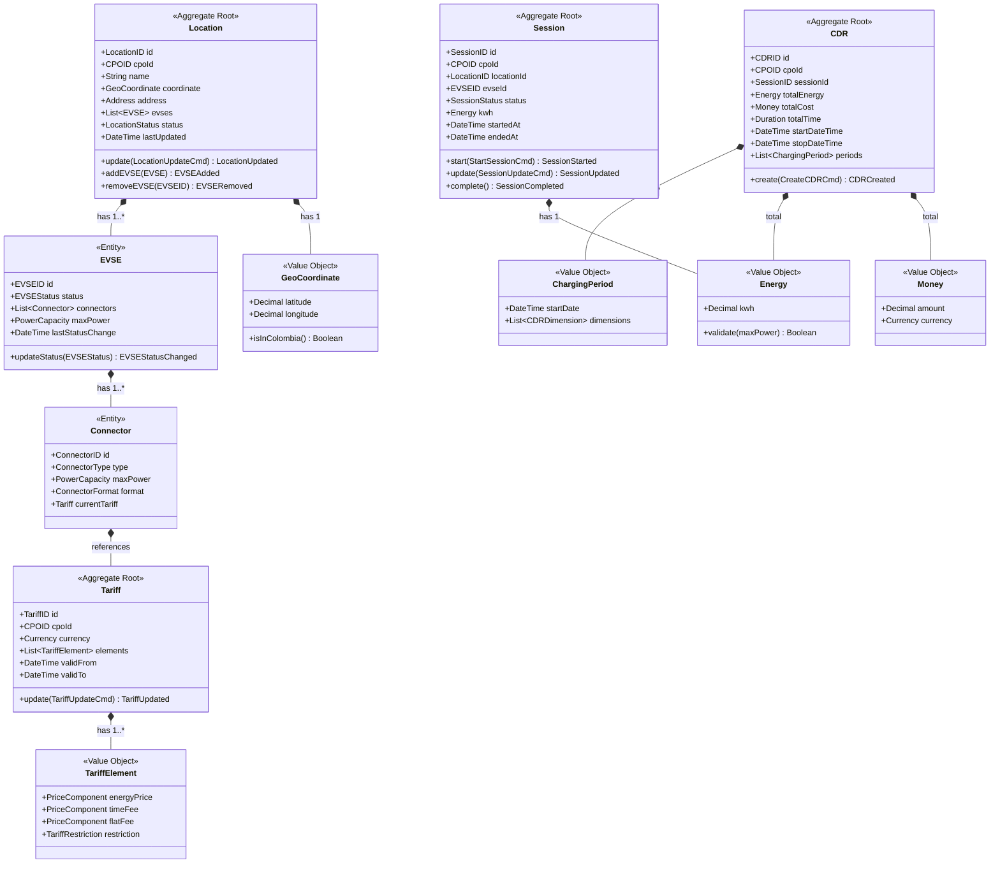
```mermaid
classDiagram
    class Location {
        <<Aggregate Root>>
        +LocationID id
        +CPOID cpoId
        +String name
        +GeoCoordinate coordinate
        +Address address
        +List~EVSE~ evses
        +LocationStatus status
        +DateTime lastUpdated
        +update(LocationUpdateCmd) LocationUpdated
        +addEVSE(EVSE) EVSEAdded
        +removeEVSE(EVSEID) EVSERemoved
    }

    class EVSE {
        <<Entity>>
        +EVSEID id
        +EVSEStatus status
        +List~Connector~ connectors
        +PowerCapacity maxPower
        +DateTime lastStatusChange
        +updateStatus(EVSEStatus) EVSEStatusChanged
    }

    class Connector {
        <<Entity>>
        +ConnectorID id
        +ConnectorType type
        +PowerCapacity maxPower
        +ConnectorFormat format
        +Tariff currentTariff
    }

    class Tariff {
        <<Aggregate Root>>
        +TariffID id
        +CPOID cpoId
        +Currency currency
        +List~TariffElement~ elements
        +DateTime validFrom
        +DateTime validTo
        +update(TariffUpdateCmd) TariffUpdated
    }

    class TariffElement {
        <<Value Object>>
        +PriceComponent energyPrice
        +PriceComponent timeFee
        +PriceComponent flatFee
        +TariffRestriction restriction
    }

    class Session {
        <<Aggregate Root>>
        +SessionID id
        +CPOID cpoId
        +LocationID locationId
        +EVSEID evseId
        +SessionStatus status
        +Energy kwh
        +DateTime startedAt
        +DateTime endedAt
        +start(StartSessionCmd) SessionStarted
        +update(SessionUpdateCmd) SessionUpdated
        +complete() SessionCompleted
    }

    class CDR {
        <<Aggregate Root>>
        +CDRID id
        +CPOID cpoId
        +SessionID sessionId
        +Energy totalEnergy
        +Money totalCost
        +Duration totalTime
        +DateTime startDateTime
        +DateTime stopDateTime
        +List~ChargingPeriod~ periods
        +create(CreateCDRCmd) CDRCreated
    }

    class ChargingPeriod {
        <<Value Object>>
        +DateTime startDate
        +List~CDRDimension~ dimensions
    }

    class GeoCoordinate {
        <<Value Object>>
        +Decimal latitude
        +Decimal longitude
        +isInColombia() Boolean
    }

    class Energy {
        <<Value Object>>
        +Decimal kwh
        +validate(maxPower) Boolean
    }

    class Money {
        <<Value Object>>
        +Decimal amount
        +Currency currency
    }

    Location *-- EVSE : has 1..*
    EVSE *-- Connector : has 1..*
    Connector *-- Tariff : references
    Location *-- GeoCoordinate : has 1
    Session *-- Energy : has 1
    CDR *-- ChargingPeriod : has 1..*
    CDR *-- Energy : total
    CDR *-- Money : total
    Tariff *-- TariffElement : has 1..*
```

### 5.3 BC3: Identity & Access — Domain Model

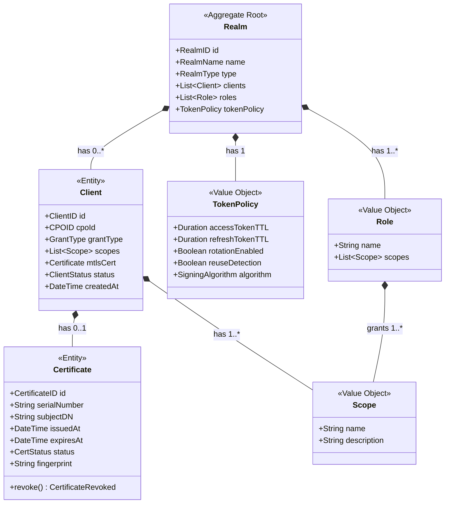
```mermaid
classDiagram
    class Realm {
        <<Aggregate Root>>
        +RealmID id
        +RealmName name
        +RealmType type
        +List~Client~ clients
        +List~Role~ roles
        +TokenPolicy tokenPolicy
    }

    class Client {
        <<Entity>>
        +ClientID id
        +CPOID cpoId
        +GrantType grantType
        +List~Scope~ scopes
        +Certificate mtlsCert
        +ClientStatus status
        +DateTime createdAt
    }

    class TokenPolicy {
        <<Value Object>>
        +Duration accessTokenTTL
        +Duration refreshTokenTTL
        +Boolean rotationEnabled
        +Boolean reuseDetection
        +SigningAlgorithm algorithm
    }

    class Certificate {
        <<Entity>>
        +CertificateID id
        +String serialNumber
        +String subjectDN
        +DateTime issuedAt
        +DateTime expiresAt
        +CertStatus status
        +String fingerprint
        +revoke() CertificateRevoked
    }

    class Scope {
        <<Value Object>>
        +String name
        +String description
    }

    class Role {
        <<Value Object>>
        +String name
        +List~Scope~ scopes
    }

    Realm *-- Client : has 0..*
    Realm *-- Role : has 1..*
    Realm *-- TokenPolicy : has 1
    Client *-- Certificate : has 0..1
    Client *-- Scope : has 1..*
    Role *-- Scope : grants 1..*
```

### 5.4 Domain Events — Catálogo Completo

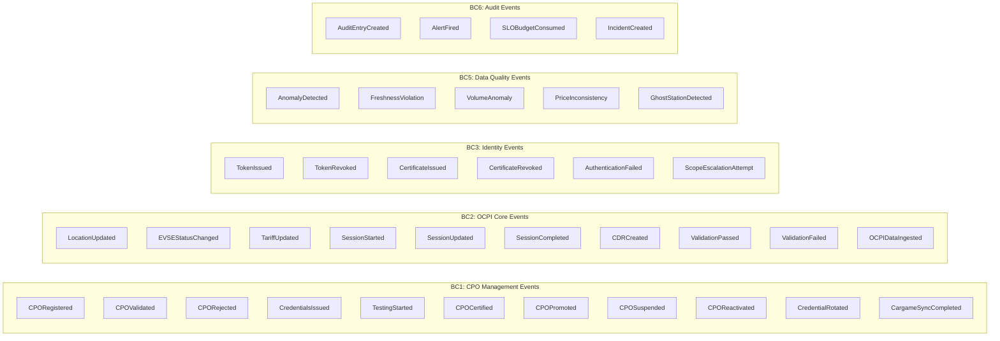
```mermaid
graph LR
    subgraph "BC1: CPO Management Events"
        E1["CPORegistered"]
        E2["CPOValidated"]
        E3["CPORejected"]
        E4["CredentialsIssued"]
        E5["TestingStarted"]
        E6["CPOCertified"]
        E7["CPOPromoted"]
        E8["CPOSuspended"]
        E9["CPOReactivated"]
        E10["CredentialRotated"]
        E11["CargameSyncCompleted"]
    end

    subgraph "BC2: OCPI Core Events"
        E20["LocationUpdated"]
        E21["EVSEStatusChanged"]
        E22["TariffUpdated"]
        E23["SessionStarted"]
        E24["SessionUpdated"]
        E25["SessionCompleted"]
        E26["CDRCreated"]
        E27["ValidationPassed"]
        E28["ValidationFailed"]
        E29["OCPIDataIngested"]
    end

    subgraph "BC3: Identity Events"
        E30["TokenIssued"]
        E31["TokenRevoked"]
        E32["CertificateIssued"]
        E33["CertificateRevoked"]
        E34["AuthenticationFailed"]
        E35["ScopeEscalationAttempt"]
    end

    subgraph "BC5: Data Quality Events"
        E40["AnomalyDetected"]
        E41["FreshnessViolation"]
        E42["VolumeAnomaly"]
        E43["PriceInconsistency"]
        E44["GhostStationDetected"]
    end

    subgraph "BC6: Audit Events"
        E50["AuditEntryCreated"]
        E51["AlertFired"]
        E52["SLOBudgetConsumed"]
        E53["IncidentCreated"]
    end
```

**Kafka Topics por Domain Event:**

| Topic | Eventos | Particiones | Retención | Consumer Groups |
|-------|---------|-------------|-----------|-----------------|
| `cpo-events` | CPORegistered, CPOCertified, CPOSuspended, etc. | 12 (by CPO ID) | 7d | ocpi-core, audit, notification |
| `ocpi-locations-events` | LocationUpdated, EVSEStatusChanged | 24 (by CPO ID) | 7d | validator, public-data, datalake, audit |
| `ocpi-sessions-events` | SessionStarted, SessionUpdated, SessionCompleted | 24 (by CPO ID) | 7d | validator, datalake, audit |
| `ocpi-cdrs-events` | CDRCreated | 12 (by CPO ID) | 30d | validator, datalake, audit |
| `ocpi-tariffs-events` | TariffUpdated | 6 (by CPO ID) | 7d | validator, public-data, datalake |
| `validation-results` | ValidationPassed, ValidationFailed | 12 | 7d | state-updater, datalake, audit |
| `quality-events` | AnomalyDetected, FreshnessViolation, etc. | 6 | 30d | alerting, audit |
| `audit-events` | AuditEntryCreated, AlertFired | 12 | 365d (WORM) | audit-trail, SIC-exporter |
| `notification-events` | (all types that trigger notifications) | 6 | 3d | webhook-dispatcher, notification-svc |
| `ocpi-dlq` | Failed validations, poison pills | 6 | 30d | dlq-handler (manual) |

### 5.5 Domain Event Schema (ejemplo)

```json
{
    "$schema": "https://json-schema.org/draft/2020-12/schema",
    "title": "UPME Domain Event Envelope",
    "type": "object",
    "required": ["eventId", "eventType", "aggregateId", "aggregateType", "occurredAt", "data", "metadata"],
    "properties": {
        "eventId": { "type": "string", "format": "uuid" },
        "eventType": { "type": "string", "example": "LocationUpdated" },
        "aggregateId": { "type": "string", "format": "uuid" },
        "aggregateType": { "type": "string", "example": "Location" },
        "version": { "type": "integer", "minimum": 1 },
        "occurredAt": { "type": "string", "format": "date-time" },
        "data": {
            "type": "object",
            "description": "Event-specific payload"
        },
        "metadata": {
            "type": "object",
            "properties": {
                "correlationId": { "type": "string", "format": "uuid" },
                "causationId": { "type": "string", "format": "uuid" },
                "cpoId": { "type": "string" },
                "userId": { "type": "string" },
                "source": { "type": "string", "example": "ingesta-service" },
                "traceId": { "type": "string" },
                "spanId": { "type": "string" }
            }
        }
    }
}
```

---

## 6. Flujos de Dominio

### 6.1 Flujo Principal: CPO Reporta Location (Write Path)

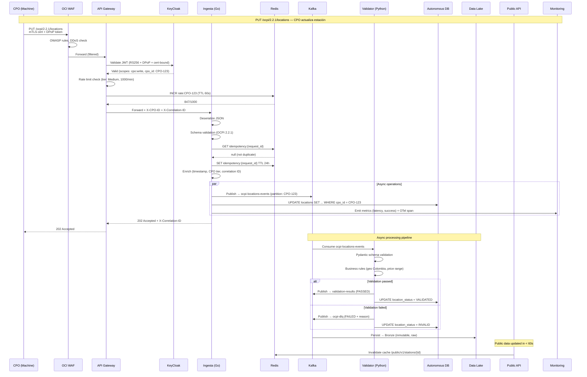
```mermaid
sequenceDiagram
    participant CPO as CPO (Machine)
    participant WAF as OCI WAF
    participant GW as API Gateway
    participant KC as KeyCloak
    participant ING as Ingesta (Go)
    participant RED as Redis
    participant KFK as Kafka
    participant VAL as Validator (Python)
    participant DB as Autonomous DB
    participant LAKE as Data Lake
    participant PUB as Public API
    participant MON as Monitoring

    Note over CPO,MON: PUT /ocpi/2.2.1/locations — CPO actualiza estación

    CPO->>WAF: PUT /ocpi/2.2.1/locations<br/>mTLS cert + DPoP token
    WAF->>WAF: OWASP rules, DDoS check
    WAF->>GW: Forward (filtered)
    
    GW->>KC: Validate JWT (RS256 + DPoP + cert-bound)
    KC-->>GW: Valid (scopes: cpo:write, cpo_id: CPO-123)
    
    GW->>GW: Rate limit check (tier: Medium, 1000/min)
    GW->>RED: INCR rate:CPO-123 (TTL 60s)
    RED-->>GW: 847/1000
    
    GW->>ING: Forward + X-CPO-ID + X-Correlation-ID
    
    ING->>ING: Deserialize JSON
    ING->>ING: Schema validation (OCPI 2.2.1)
    ING->>RED: GET idempotency:{request_id}
    RED-->>ING: null (not duplicate)
    ING->>RED: SET idempotency:{request_id} TTL 24h
    
    ING->>ING: Enrich (timestamp, CPO tier, correlation ID)
    
    par Async operations
        ING->>KFK: Publish → ocpi-locations-events (partition: CPO-123)
        ING->>DB: UPDATE locations SET ... WHERE cpo_id = CPO-123
        ING->>MON: Emit metrics (latency, success) + OTel span
    end
    
    ING-->>GW: 202 Accepted + X-Correlation-ID
    GW-->>CPO: 202 Accepted

    Note over KFK,LAKE: Async processing pipeline

    KFK->>VAL: Consume ocpi-locations-events
    VAL->>VAL: Pydantic schema validation
    VAL->>VAL: Business rules (geo Colombia, price range)
    
    alt Validation passed
        VAL->>KFK: Publish → validation-results (PASSED)
        VAL->>DB: UPDATE location_status = VALIDATED
    else Validation failed
        VAL->>KFK: Publish → ocpi-dlq (FAILED + reason)
        VAL->>DB: UPDATE location_status = INVALID
    end

    KFK->>LAKE: Persist → Bronze (inmutable, raw)
    
    Note over PUB: Public data updated in < 60s
    PUB->>RED: Invalidate cache /public/v1/stations/{id}
```

### 6.2 Flujo: Onboarding CPO (Registration to Production)

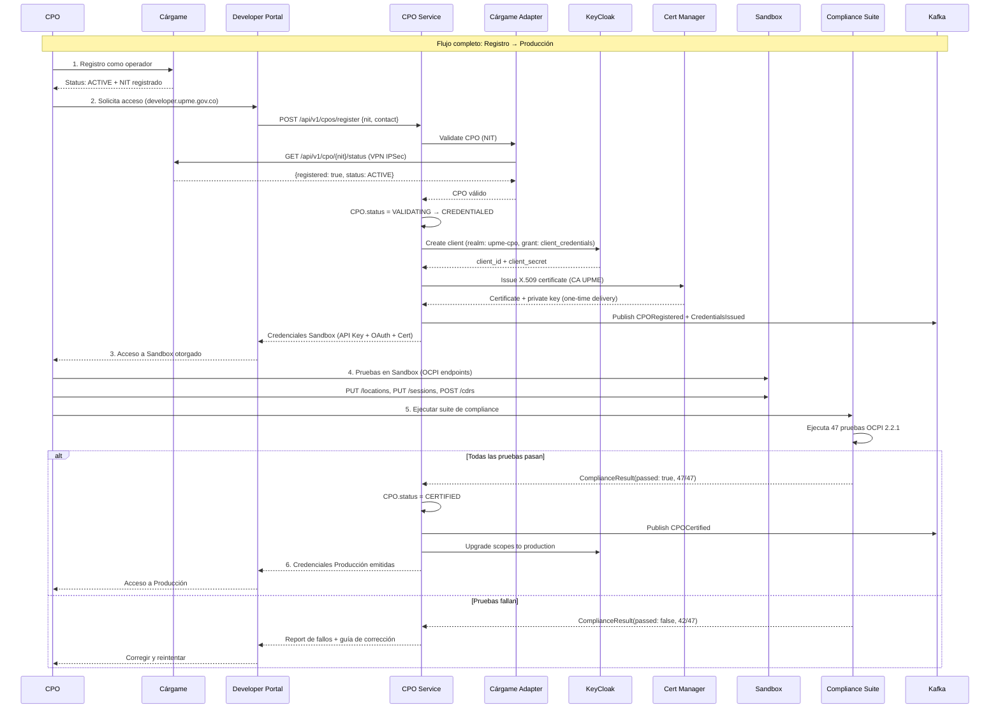
```mermaid
sequenceDiagram
    participant CPO as CPO
    participant CARG as Cárgame
    participant DEV as Developer Portal
    participant SVC as CPO Service
    participant ACL as Cárgame Adapter
    participant KC as KeyCloak
    participant CERT as Cert Manager
    participant SAND as Sandbox
    participant COMP as Compliance Suite
    participant KFK as Kafka

    Note over CPO,KFK: Flujo completo: Registro → Producción

    CPO->>CARG: 1. Registro como operador
    CARG-->>CPO: Status: ACTIVE + NIT registrado

    CPO->>DEV: 2. Solicita acceso (developer.upme.gov.co)
    DEV->>SVC: POST /api/v1/cpos/register {nit, contact}
    
    SVC->>ACL: Validate CPO (NIT)
    ACL->>CARG: GET /api/v1/cpo/{nit}/status (VPN IPSec)
    CARG-->>ACL: {registered: true, status: ACTIVE}
    ACL-->>SVC: CPO válido

    SVC->>SVC: CPO.status = VALIDATING → CREDENTIALED
    SVC->>KC: Create client (realm: upme-cpo, grant: client_credentials)
    KC-->>SVC: client_id + client_secret
    SVC->>CERT: Issue X.509 certificate (CA UPME)
    CERT-->>SVC: Certificate + private key (one-time delivery)
    SVC->>KFK: Publish CPORegistered + CredentialsIssued

    SVC-->>DEV: Credenciales Sandbox (API Key + OAuth + Cert)
    DEV-->>CPO: 3. Acceso a Sandbox otorgado

    CPO->>SAND: 4. Pruebas en Sandbox (OCPI endpoints)
    CPO->>SAND: PUT /locations, PUT /sessions, POST /cdrs
    
    CPO->>COMP: 5. Ejecutar suite de compliance
    COMP->>COMP: Ejecuta 47 pruebas OCPI 2.2.1
    
    alt Todas las pruebas pasan
        COMP-->>SVC: ComplianceResult(passed: true, 47/47)
        SVC->>SVC: CPO.status = CERTIFIED
        SVC->>KFK: Publish CPOCertified
        SVC->>KC: Upgrade scopes to production
        SVC-->>DEV: 6. Credenciales Producción emitidas
        DEV-->>CPO: Acceso a Producción
    else Pruebas fallan
        COMP-->>SVC: ComplianceResult(passed: false, 42/47)
        SVC-->>DEV: Report de fallos + guía de corrección
        DEV-->>CPO: Corregir y reintentar
    end
```

### 6.3 Flujo: Detección de Anomalía en Precio

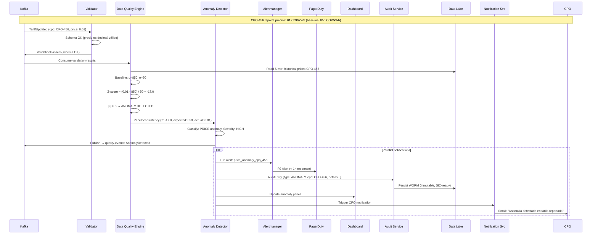
```mermaid
sequenceDiagram
    participant KFK as Kafka
    participant VAL as Validator
    participant DQ as Data Quality Engine
    participant ANOM as Anomaly Detector
    participant MON as Alertmanager
    participant PD as PagerDuty
    participant DASH as Dashboard
    participant AUD as Audit Service
    participant LAKE as Data Lake
    participant NOTIF as Notification Svc
    participant CPO as CPO

    Note over KFK,CPO: CPO-456 reporta precio 0.01 COP/kWh (baseline: 850 COP/kWh)

    KFK->>VAL: TariffUpdated {cpo: CPO-456, price: 0.01}
    VAL->>VAL: Schema OK (precio es decimal válido)
    VAL->>KFK: ValidationPassed (schema OK)
    
    KFK->>DQ: Consume validation-results
    DQ->>LAKE: Read Silver: historical prices CPO-456
    DQ->>DQ: Baseline: μ=850, σ=50
    DQ->>DQ: Z-score = (0.01 - 850) / 50 = -17.0
    DQ->>DQ: |Z| > 3 → ANOMALY DETECTED
    
    DQ->>ANOM: PriceInconsistency {z: -17.0, expected: 850, actual: 0.01}
    ANOM->>ANOM: Classify: PRICE anomaly, Severity: HIGH
    ANOM->>KFK: Publish → quality-events: AnomalyDetected
    
    par Parallel notifications
        ANOM->>MON: Fire alert: price_anomaly_cpo_456
        MON->>PD: P2 Alert (< 1h response)
        ANOM->>AUD: AuditEntry {type: ANOMALY, cpo: CPO-456, details...}
        AUD->>LAKE: Persist WORM (inmutable, SIC-ready)
        ANOM->>DASH: Update anomaly panel
        ANOM->>NOTIF: Trigger CPO notification
        NOTIF->>CPO: Email: "Anomalía detectada en tarifa reportada"
    end
```

### 6.4 Flujo: Suspensión de CPO por Cárgame

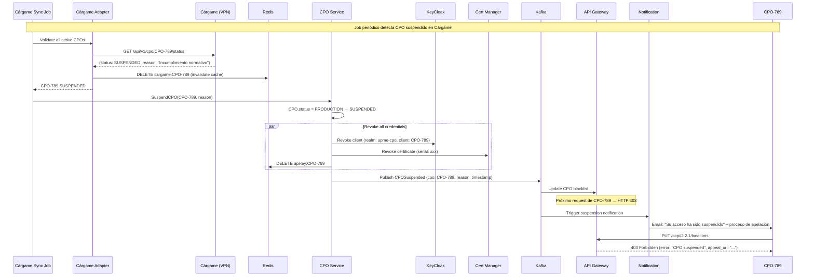
```mermaid
sequenceDiagram
    participant SYNC as Cárgame Sync Job
    participant ACL as Cárgame Adapter
    participant CARG as Cárgame (VPN)
    participant RED as Redis
    participant SVC as CPO Service
    participant KC as KeyCloak
    participant CERT as Cert Manager
    participant KFK as Kafka
    participant GW as API Gateway
    participant NOTIF as Notification
    participant CPO as CPO-789

    Note over SYNC,CPO: Job periódico detecta CPO suspendido en Cárgame

    SYNC->>ACL: Validate all active CPOs
    ACL->>CARG: GET /api/v1/cpo/CPO-789/status
    CARG-->>ACL: {status: SUSPENDED, reason: "Incumplimiento normativo"}
    ACL->>RED: DELETE cargame:CPO-789 (invalidate cache)
    ACL-->>SYNC: CPO-789 SUSPENDED

    SYNC->>SVC: SuspendCPO(CPO-789, reason)
    SVC->>SVC: CPO.status = PRODUCTION → SUSPENDED
    
    par Revoke all credentials
        SVC->>KC: Revoke client (realm: upme-cpo, client: CPO-789)
        SVC->>CERT: Revoke certificate (serial: xxx)
        SVC->>RED: DELETE apikey:CPO-789
    end
    
    SVC->>KFK: Publish CPOSuspended {cpo: CPO-789, reason, timestamp}
    
    KFK->>GW: Update CPO blacklist
    Note over GW: Próximo request de CPO-789 → HTTP 403
    
    KFK->>NOTIF: Trigger suspension notification
    NOTIF->>CPO: Email: "Su acceso ha sido suspendido" + proceso de apelación
    
    CPO->>GW: PUT /ocpi/2.2.1/locations
    GW-->>CPO: 403 Forbidden {error: "CPO suspended", appeal_url: "..."}
```

---

## 7. Decisiones de Arquitectura (ADRs Resumen)

| ADR | Título | Decisión | Alternativas Descartadas | Impacto Regulatorio |
|-----|--------|----------|-------------------------|-------------------|
| ADR-001 | **Lenguaje de Ingesta** | Go 1.22+ | Java (overhead GC), Rust (curva aprendizaje), Node.js (event loop blocking) | Garantiza < 100ms P99 para cumplir SLA mandatorio |
| ADR-002 | **Validador OCPI** | Python 3.12+ (Pydantic) | Go (menos expresivo para schemas), Java (overhead) | Ecosistema rico para validación de schemas OCPI 2.2.1 |
| ADR-003 | **Identity Provider** | KeyCloak 24+ (Quarkus) | Auth0 (vendor lock-in, costo), Ory Hydra (menos features), Custom (riesgo) | OAuth 2.1 compliant, RBAC para roles SIC/MinEnergía |
| ADR-004 | **Event Streaming** | OCI Streaming (Kafka API) | Self-hosted Kafka (ops overhead), Pulsar (menos ecosistema), NATS (menos features) | Retención 7d para auditoría SIC |
| ADR-005 | **CQRS** | Command/Query separation | CRUD monolítico (no escala lectura), Full event sourcing (complejidad prematura) | Separación permite optimizar consulta pública (mandato 90d) |
| ADR-006 | **Data Lake Architecture** | Medallion (Bronze→Silver→Gold) | Single-tier (no linaje), Lambda (complejidad dual) | Trazabilidad end-to-end requerida por SIC |
| ADR-007 | **API Gateway** | PoC: OCI API GW vs Kong | Apache APISIX, Traefik | Rate limiting por CPO tier requerido por guía técnica |
| ADR-008 | **Auth Protocol** | OAuth 2.1 (PKCE + DPoP) | OAuth 2.0 (menos seguro), API Key only (insuficiente) | Cumple estándares IETF más recientes, previene token theft |
| ADR-009 | **mTLS + Certificate-Bound** | RFC 8705 cert-bound tokens | mTLS only (no identity binding), IP whitelist only | Defense-in-depth para CPOs, cada token ligado a cert específico |
| ADR-010 | **Anomaly Detection** | Statistical (Z-score + seasonal) | ML complex (premature), Rule-only (misses patterns) | Detecta fraude en datos reportados (SIC requirement) |
| ADR-011 | **Audit Storage** | WORM Object Storage | DB only (mutable), Blockchain (overkill) | Logs inmutables mandatorios para auditoría SIC |
| ADR-012 | **Anti-Corruption Layer** | Dedicated Cárgame Adapter | Direct integration (domain leak), Shared library (coupling) | Aísla modelo externo, circuit breaker protege disponibilidad |
| ADR-013 | **Frontend Framework** | React 18 + TypeScript | Vue 3 (menos ecosystem), Angular (heavyweight), Svelte (less mature) | Portal público mandato 90d, maps + RT updates |
| ADR-014 | **Observability** | OpenTelemetry + OCI APM + Grafana | Vendor-only (lock-in), Custom (fragile) | 4 capas de monitoreo (tráfico, servicio, datos, negocio) |

---

## Apéndice A: Kafka Topics — Diagrama de Flujo

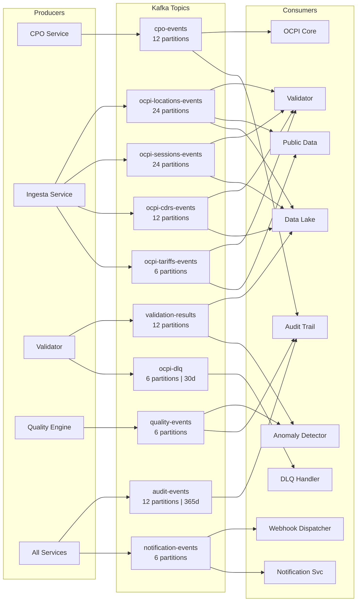
```mermaid
graph LR
    subgraph "Producers"
        P1["CPO Service"]
        P2["Ingesta Service"]
        P3["Validator"]
        P4["Quality Engine"]
        P5["All Services"]
    end

    subgraph "Kafka Topics"
        T1["cpo-events<br/>12 partitions"]
        T2["ocpi-locations-events<br/>24 partitions"]
        T3["ocpi-sessions-events<br/>24 partitions"]
        T4["ocpi-cdrs-events<br/>12 partitions"]
        T5["ocpi-tariffs-events<br/>6 partitions"]
        T6["validation-results<br/>12 partitions"]
        T7["quality-events<br/>6 partitions"]
        T8["audit-events<br/>12 partitions | 365d"]
        T9["notification-events<br/>6 partitions"]
        T10["ocpi-dlq<br/>6 partitions | 30d"]
    end

    subgraph "Consumers"
        C1["OCPI Core"]
        C2["Validator"]
        C3["Public Data"]
        C4["Data Lake"]
        C5["Audit Trail"]
        C6["Anomaly Detector"]
        C7["Webhook Dispatcher"]
        C8["Notification Svc"]
        C9["DLQ Handler"]
    end

    P1 --> T1
    P2 --> T2
    P2 --> T3
    P2 --> T4
    P2 --> T5
    P3 --> T6
    P3 --> T10
    P4 --> T7
    P5 --> T8
    P5 --> T9

    T1 --> C1
    T1 --> C5
    T2 --> C2
    T2 --> C3
    T2 --> C4
    T3 --> C2
    T3 --> C4
    T4 --> C2
    T4 --> C4
    T5 --> C2
    T5 --> C3
    T6 --> C4
    T6 --> C6
    T7 --> C6
    T7 --> C5
    T8 --> C5
    T9 --> C7
    T9 --> C8
    T10 --> C9
```

---

## Apéndice B: Deployment Diagram — OCI

```mermaid
graph TB
    subgraph "OCI Region: Bogotá (Primary)"
        subgraph "VCN: upme-production"
            subgraph "Public Subnet"
                WAF_D["OCI WAF"]
                LB["OCI Load Balancer<br/>TLS 1.3 termination"]
            end
            
            subgraph "Private Subnet: App Tier"
                subgraph "OKE Cluster (3+ nodes)"
                    NS_CORE["Namespace: ocpi-core<br/>Ingesta (3 pods)<br/>Validator (2 pods)<br/>Query (2 pods)<br/>Command (1 pod)"]
                    NS_MGMT["Namespace: cpo-mgmt<br/>CPO Service (2 pods)<br/>Compliance (1 pod)"]
                    NS_IDENT["Namespace: identity<br/>KeyCloak (2 pods)<br/>Cert Manager (1 pod)"]
                    NS_PUB["Namespace: public<br/>Public API (2 pods)<br/>Portal (2 pods)"]
                    NS_OBS["Namespace: observability<br/>Prometheus (1 pod)<br/>Grafana (1 pod)<br/>Jaeger (1 pod)<br/>Anomaly (1 pod)"]
                    NS_INT["Namespace: integration<br/>Cárgame Adapter (2 pods)<br/>Webhook (1 pod)<br/>Notifications (1 pod)"]
                end
            end
            
            subgraph "Private Subnet: Data Tier"
                ATP["OCI Autonomous DB<br/>(ATP) + Data Guard"]
                TSDB_D["TimescaleDB (OKE)<br/>2 pods StatefulSet"]
                REDIS_D["OCI Cache (Redis)<br/>HA cluster"]
                KC_DB["PostgreSQL KC<br/>+ Data Guard"]
            end
            
            subgraph "Private Subnet: Streaming"
                STREAM["OCI Streaming<br/>10 topics, 200+ partitions"]
                QUEUE["OCI Queue (DLQ)"]
            end
        end
        
        subgraph "OCI Services"
            OBJ["Object Storage<br/>(Data Lake + WORM)"]
            VAULT_D["OCI Vault<br/>(HSM FIPS 140-2 L3)"]
            DEVOPS["OCI DevOps<br/>+ ArgoCD"]
            MON_D["OCI Monitoring<br/>+ Logging Analytics"]
            GG["OCI GoldenGate<br/>(CDC)"]
            DF["OCI Data Flow<br/>(Spark ETL)"]
            DC["OCI Data Catalog"]
        end
    end

    subgraph "OCI Region: São Paulo (DR)"
        DR_OKE["OKE (Warm Standby)"]
        DR_ATP["Autonomous DB<br/>(Data Guard Standby)"]
        DR_OBJ["Object Storage<br/>(Cross-Region Replication)"]
    end

    subgraph "External"
        VPN_CARG["VPN IPSec → Cárgame"]
        LDAP_EXT["LDAPS → UPME AD"]
    end

    WAF_D --> LB
    LB --> NS_CORE
    LB --> NS_PUB
    NS_CORE --> ATP
    NS_CORE --> REDIS_D
    NS_CORE --> STREAM
    NS_IDENT --> KC_DB
    NS_IDENT --> VAULT_D
    NS_OBS --> MON_D
    NS_INT --> VPN_CARG
    NS_IDENT --> LDAP_EXT
    STREAM --> OBJ
    GG --> ATP
    GG --> OBJ
    DF --> OBJ
    DC --> OBJ
    
    ATP -.->|Data Guard| DR_ATP
    OBJ -.->|Replication| DR_OBJ
```
